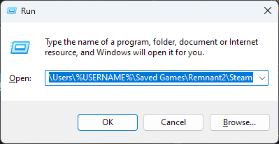

Your saves come in two parts.

⚠️ All of these instances are targeting normal (non hardcore) characters.

`profile.sav` - This contains the information for all your characters, like their experience, account rewards and inventory, for up to 5 characters

Each character corresponds to a save file using a number and starting from 0.

Character 1 = `save_0.sav`

Character 2 = `save_1.sav`

Character 3 = `save_2.sav`

Character 4 = `save_3.sav`

Character 5 = `save_4.sav`

These save file contain your world progress info. Importantly, they are also where quest items are stored.

This separation of information allows us to hot swap these saves with our profile by loading a save file that corresponds to the character number we want hot swapped.

This means you don't need a host to do these things. Here are some quick examples.

- Open Hands for scrap
- Load at a checkpoint before Tal'Ratha
- Load at Nightweaver web with all key items
- Load at any location or checkpoint with a unique world state for events, items or boss kills.
- Load prepped areas that have puzzles done and/or areas explored and random drops listed.

<!-- There are lots of useful possibilities here. -->

## How to backup saves

### Manually

Windows key + R and paste this to go to the folder where you Steam ID folder will be. Back up the whole folder.

```
C:\Users\%USERNAME%\Saved Games\Remnant2\Steam
```



### Windows Command via `cmd.exe` will backup to desktop

Windows Key ⊞

```cmd
Xcopy "C:\Users\%USERNAME%\Saved Games\Remnant2\Steam" "C:\Users\%USERNAME%\Desktop\Remnant 2\Steam\" /v /y /i /s
```

### RemnantSaveGuardian

1. Download and install [Microsoft .NET 6.0](https://dotnet.microsoft.com/en-us/download) or greater
2. Download the [latest release](https://github.com/Razzmatazzz/RemnantSaveGuardian/releases/latest/download/RemnantSaveGuardian.zip)
3. Unzip the latest release to a folder of your choosing (probably not the same folder where you have the game installed)
4. Run RemnantSaveGuardian.exe

To export your current save to a selected destination you do this:


## How to use these

Each instance will have 5 identical copies of the instance for each potential character.

⚠️ Exit the game first. This must be done when the game is closed.

**1:** Backup up your saves. They are located here for Steam.

```
C:\Users\%USERNAME%\Saved Games\Remnant2\Steam\<STEAMID>
```

**2:** Delete the `save_NUMBER.sav` file associated with your character. NOT your `profile.sav`

**3:** Download and swap in the instance you want with the corresponding save file

🔷 Example: Let's say you want the [hand farm and stacked Cass shop instance](https://github.com/razeedazee/remnant2-instances/tree/main/instances/Farming/great%20sewers%20hands/Hands)

Click on the save file corresponding to the character you need to use it with. `0` for your first, in this example.

The click the download button to download this single file.


Copy this save to your game save folder for Steam or Epic and replace the existing one (that you have been asked to backup multiple times by now)

**4:** Load the game and play the instance.

**5:** When done exit the game

**6:** Restore you old `save_NUMBER.sav` file, NOT your profile.sav.

You will now have an updated profile and be in your original world.

🔷 You can host these instances for others.
