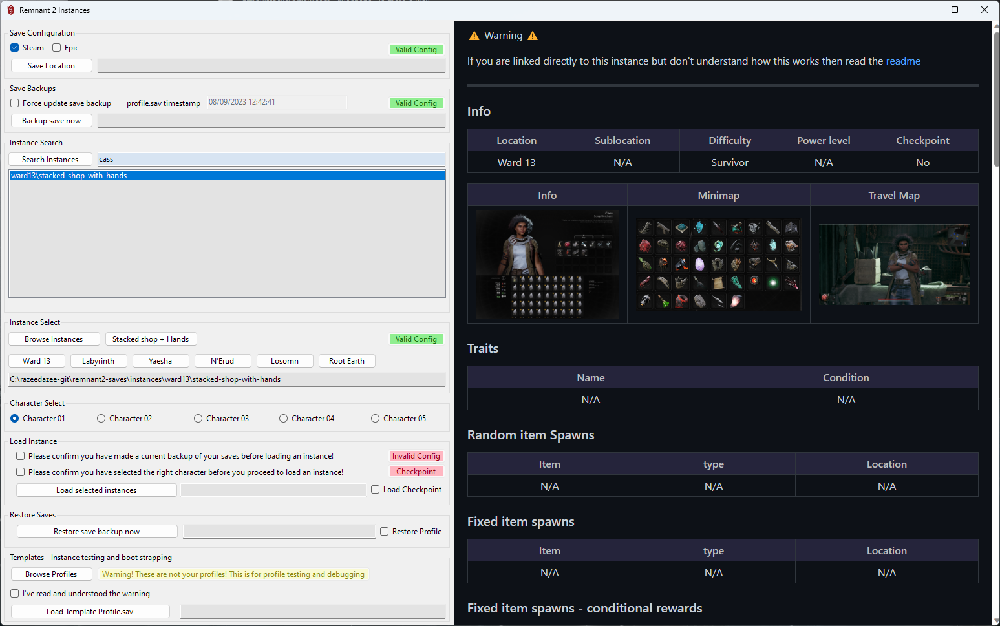

# Remnant 2 Instances - reusable and configured save game instances

## Disclaimer - Here be Dragons

⚠️ The majority of these instances are targeting normal (non hardcore) characters with customized instances to access items, traits, rewards and events. In principle this is like multiplayer worlds without the required of coop host. You self host. This is not modding or tampering with the game or files. Anyone can host these saves for themselves or in coop and they can and do provide valid avenues to fixing certain issues like bugged achievements and account rewards.

⚠️ There are some difficulty linked instances and profiles which should be used with caution as their primary function is testing/fixing and they may provide you achievements and rewards you wanted to acquire in more a traditional way. They can be used to bypass play through requirements for certain account rewards.

⚠️ If you understand this I leave the rest up to your personal choice though I would encourage people to at least try to play the game and enjoy the experience as it was intended by the developers before using those specific saves and profiles.

## What's the point of this?

This project will allow PC players to access events and items when the online community is quiet or the game is less popular. It's a Just way to be make players a little more self reliant and less dependent on mulitplayer or the good graces of other players.

The long term goal of this project is to have a template structure for saves and information that integrates with the [instances gui](https://github.com/razeedazee/remnant2-instances#instances-gui) Windows forms .NET application. This is why I did not just dump all my personal save here and the current database of instances is far from complete.

For example, instead of uploading my Apoc power level 21 save for an event I try to make a survivor power level 1/5 version with. Trying to do things like having a quest item you can fully at the point of that instance. For example, Being at the Red Prince checkpoint save, out the the throne room, with the Assassin's Dagger quest item, 3 Crimson King's coin and Nimue's retreat available via the World Stone.

Well templated save instances with a user friendly UI built with native Windows .NET 7

## How does this work?

Your saves come in two parts.

`profile.sav` - This contains the information for all your characters, like their experience, account rewards and inventory, for up to 5 characters

Each character in your `profile.sav` corresponds to a save file using a number and starting from 0.

Character 1 = `save_0.sav`

Character 2 = `save_1.sav`

Character 3 = `save_2.sav`

Character 4 = `save_3.sav`

Character 5 = `save_4.sav`

These save file contain your world progress info. Importantly, they are also where quest items are stored. Meaning you can load into a save with quest items.

This separation of information allows us to swap these saves using our profile by loading a save file that corresponds to the character number we want swapped in.

This means you don't need a host to do these things. Here are some quick examples.

- Open Hands for scrap and buy and sell from a stacked Cass
- Load at a checkpoint before Tal'Ratha to just farm a World Boss.
- Load at Nightweaver web with all key quest items
- Load at any location or checkpoint with a unique world state for events, items or boss kills.
- Load prepped areas that have puzzles done and/or areas explored and random drops listed.

There are lots of useful possibilities here.

All this method requires is that you have good understanding of backing up and restoring for game save files.

## How to backup saves

### Manually

Windows key + R and paste this to go to the folder where you Steam ID folder will be. Back up the whole folder.

```
C:\Users\%USERNAME%\Saved Games\Remnant2\Steam
```


### Windows Command via `cmd.exe` will backup to desktop

Windows Key ⊞

```cmd
Xcopy "C:\Users\%USERNAME%\Saved Games\Remnant2\Steam" "C:\Users\%USERNAME%\Desktop\Remnant 2\Steam\" /v /y /i /s
```

### RemnantSaveGuardian

1. Download and install [Microsoft .NET 6.0](https://dotnet.microsoft.com/en-us/download) or greater
2. Download the [latest release](https://github.com/Razzmatazzz/RemnantSaveGuardian/releases/latest/download/RemnantSaveGuardian.zip)
3. Unzip the latest release to a folder of your choosing (probably not the same folder where you have the game installed)
4. Run RemnantSaveGuardian.exe

To export your current save to a selected destination you do this:


## How to use these instances

⚠️ Turn off cloud sync for this game. If you have issues loading instances, restart steam.


All instances are located here <https://github.com/razeedazee/remnant2-instances/tree/main/instances>

Each instance will have 5 identical copies of the instance for each potential character.

⚠️ Exit to menu first or exit game. This must be done when the save is not loaded.

🔷 The swap can be done while exited to menu. Saves are checked and loaded after loading a character.

**1:** Backup up your saves. They are located here for Steam.

```
C:\Users\%USERNAME%\Saved Games\Remnant2\Steam\<STEAMID>
```

**2:** Delete the `save_NUMBER.sav` file associated with your character. NOT your `profile.sav`

**3:** Download and swap in the instance you want with the corresponding save file

⚠️ Organisation is a bit of a mess but i'll fix this with a more consistent method as I go along whislt trying to make sure the instance is a survivor power level 1 to 5.

🔷 Example: Let's say you want the [hand farm and stacked Cass shop instance](https://github.com/razeedazee/remnant2-instances/tree/main/instances/Farming/great%20sewers%20hands/Hands)

Click on the save file corresponding to the character you need to use it with. `0` for your first, in this example.

The click the download button to download this single file.


Copy this save to your game save folder for Steam or Epic and replace the existing one (that you have been asked to backup multiple times by now)

**4:** Load the game and play the instance.

**5:** When done exit the game

**6:** Restore you old `save_NUMBER.sav` file, NOT your profile.sav.

You will now have an updated profile and be in your original world.

🔷 You can host these instances for others.

## Instances Gui

Work in progress. A Windows forms .NET app was hacked together in Visual Studio. It's certainly a novice attempt and I'm more than happy to get feedback on why it's so poorly coded.

But, it's reasonably well thought out, tested, fucntional and I've tried to prevent most gotchas like allowing people to overwrite saves without having backups. This is the real vision of the project.

Using this app with a fully stocked set of instances allows anyone to access most items or events without requiring a host.

Download the repo <https://github.com/razeedazee/remnant2-instances/archive/refs/heads/main.zip>

🔷 You might need to download and install [Microsoft .NET 6.0](https://dotnet.microsoft.com/en-us/download) or greater first. The app will tell you when you attempt to run it.

Extract it somewhere and double click the `instances-gui.cmd`



Coming soon...

A built in method to update instances at the repo is updated.

## Need more help?

Mostly just me there, if you need help join and ping me.

<https://discord.gg/dm5bnKdd3>
