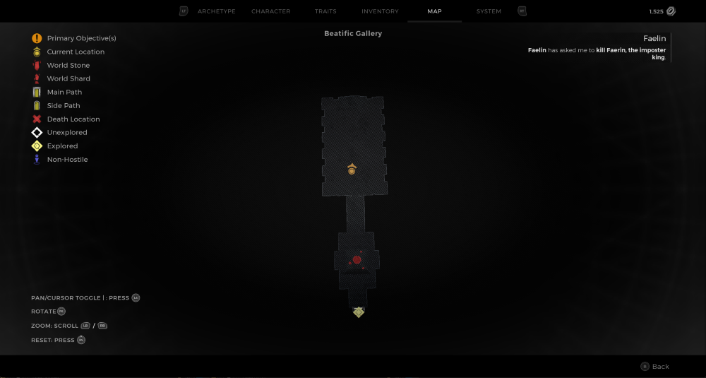
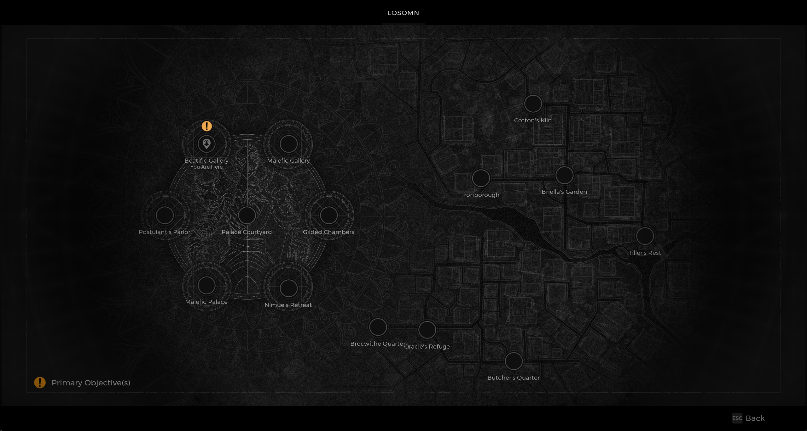

⚠️ Warning ⚠️

If you are linked directly to this instance but don't understand how this works then read the [readme](https://github.com/razeedazee/remnant2-instances/blob/main/README.md)

Info:

- Beatific Palace
- Difficulty: Survivor
- Powerlevel: 1/5

Traits:

- N/A

Random Items Spawns:

- N/A

Fixed Items spawns:

- N/A

Fixed Items spawns - conditional rewards:

- Faelin's Sigil - Speak to Faelin

Injectables:

- N/A

Bosses:

- N/A

Notes:

>

