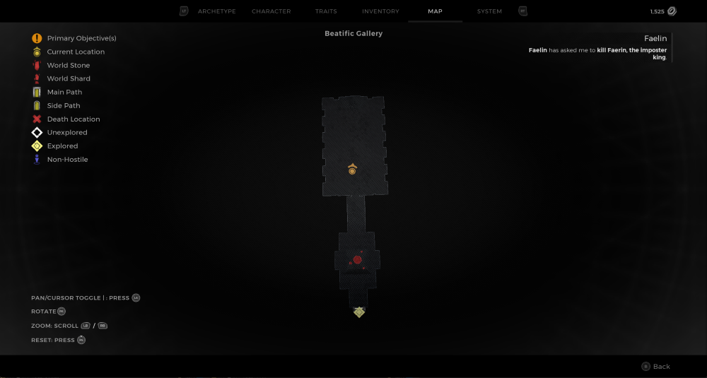

⚠️ Warning ⚠️

If you are linked directly to this instance but don't understand how this works then read the [readme](https://github.com/razeedazee/remnant2-instances/blob/main/README.md)

Info:

- Beatific Gallery
- Difficulty: Survivor
- Power level: 5
- Checkpoint: No

Traits:

- N/A

Random Items Spawns:

- N/A

Fixed Items spawns:

- N/A

Fixed Items spawns - conditional rewards:

- Faerin's Sigil - Return to Faelin after killing Faelin (see Faerin Sigil instance)

Injectables:

- N/A

Bosses:

- Faelin
  - Imposter's Heart - Crafting Material

Checkpoint:

- N/A

Notes:

>

