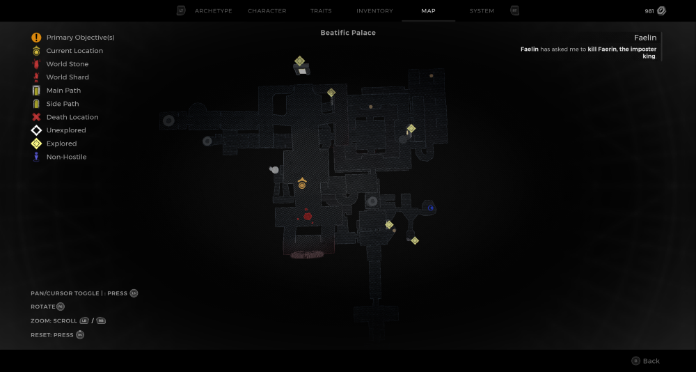
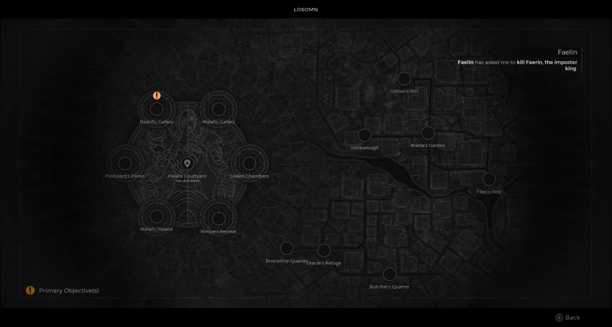

⚠️ Warning ⚠️

If you are linked directly to this instance but don't understand how this works then read the [readme](https://github.com/razeedazee/remnant2-instances/blob/main/README.md)

Info:

- Beatific Palace
- Difficulty: Survivor
- Powerlevel: 2

Traits:

- N/A

Random Items Spawns:

- N/A

Fixed Items spawns:

- N/A

Fixed Items spawns - conditional rewards:

- Unsullied Heart - Have the `One True King Sigil` equipped approach the statue in courtyard.
  - See Faerin/Faerin's Sigil and Faelin/Faelin's Sigil instances

Injectables:

- N/A

Bosses:

- N/A

Notes:

>

