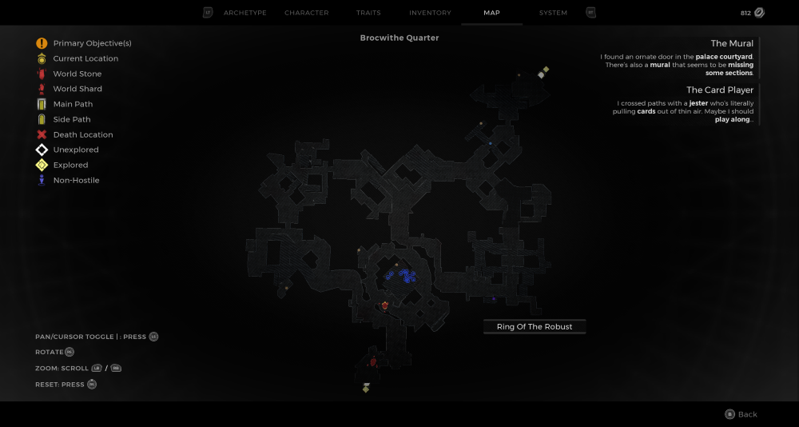
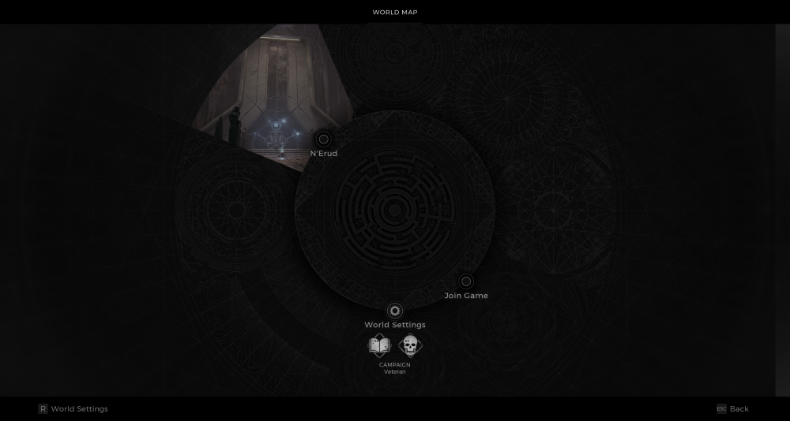

⚠️ Warning ⚠️

If you are linked directly to this instance but don't understand how this works then read the [readme](https://github.com/razeedazee/remnant2-instances/blob/main/README.md)

Info:

- Oracle's Refuge
- Difficulty: Survivor
- Powerlevel: 3

Traits:

- Recovery (Speak to the Oracle)

Random Items Spawns:

- Ring of the Robust

Fixed Items spawns:

- N/A

Fixed Items spawns - conditional rewards:

- N/A

Injectables:

- N/A

Bosses:

- N/A

Notes:

> Children have been found. Just Speak to the Oracle for Recovery Trait

