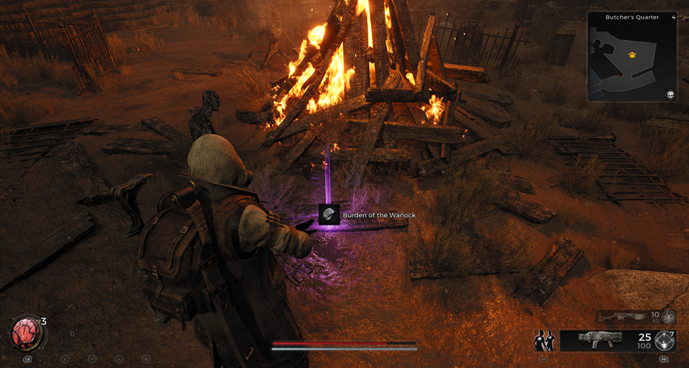
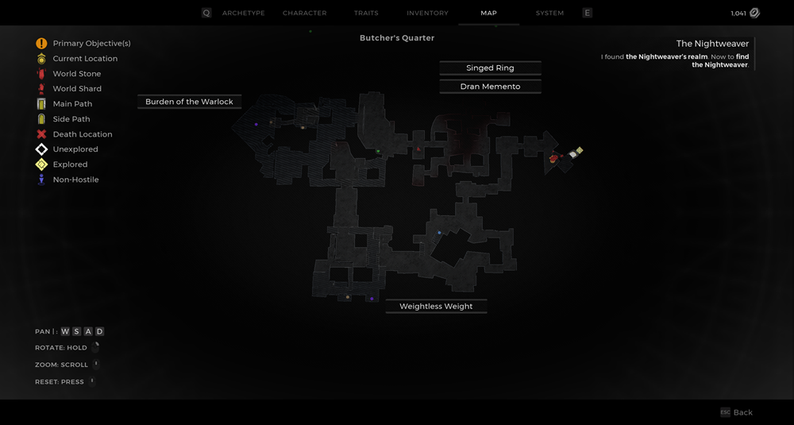
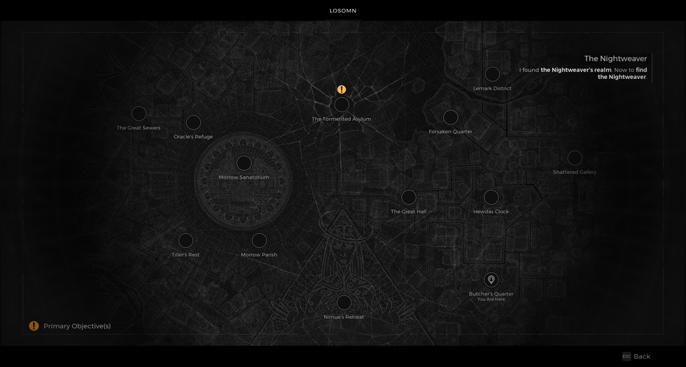

⚠️ Warning ⚠️

If you are linked directly to this instance but don't understand how this works then read the [readme](https://github.com/razeedazee/remnant2-instances/blob/main/README.md)

Info:

- Butchers Quarter
- Difficulty: Survivor
- Power level: 4
- Checkpoint: Yes

Traits:

- Shadeskin - Either outcome of the burning man event (checkpoint)

Random item Spawns:

- N/A

Fixed item spawns:

- N/A

Fixed item spawns - conditional rewards:

- Dran Memento - Save hanging dran from being set alight during burning man event. He'll give to you in the post event dialogue.
- Singed Ring - Allow hanging dran to be set alight during burning man event. Rest at checkpoint then shoot pig eating his corpse.

Injectable:

- Fiery Graveyard
  - Burden of the Warlock

Bosses:

- N/A

Checkpoint:

- Burning Man Event

Quest items relevant to instance:

- In Inventory
  - N/A
- Interactions
  - N/A

Notes:

> Checkpoint start for Butchers Event

