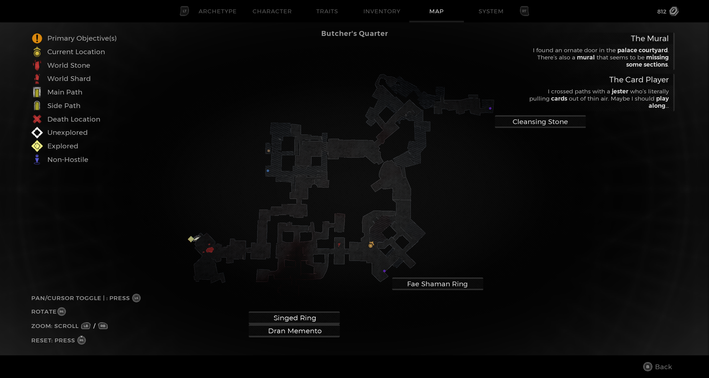
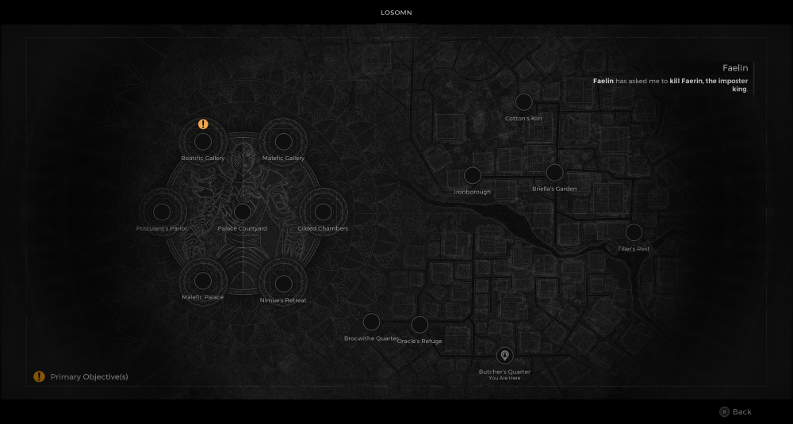

⚠️ Warning ⚠️

If you are linked directly to this instance but don't understand how this works then read the [readme](https://github.com/razeedazee/remnant2-instances/blob/main/README.md)

Info:

- Butcher's Quarter
- Difficulty: Survivor
- Power level: 4

Traits:

- Shadeskin - Either outcome of the burning man event (checkpoint)

Random Items Spawns:

- Fae Shaman Ring

Fixed Items spawns:

- N/A

Fixed Items spawns - conditional rewards:

- Dran Memento - Save hanging dran from being set alight during burning man event. He'll give to you in the post event dialogue.
- Singed Ring - Allow hanging dran to be set alight during burning man event. Rest at checkpoint then shoot pig eating his corpse.

Injectables:

- Rookery
  - Effigy Pendant (Open Wooden Box)
  - Cleansing Stone

Bosses:

- N/A

Notes:

> - The Effigy Pendant (Open Wooden Box) is already in your inventory.
> - Checkpoint start for Butchers Event

