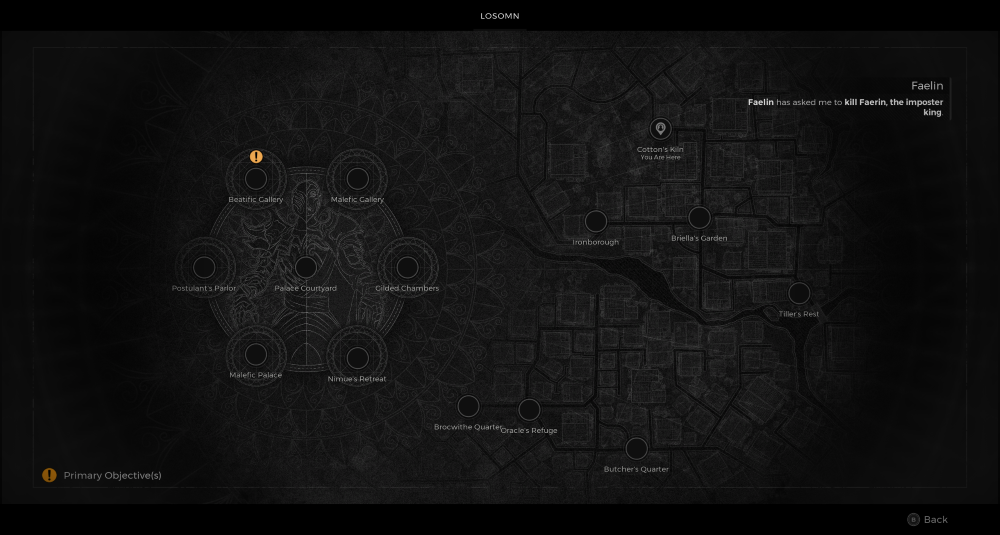

⚠️ Warning ⚠️

If you are linked directly to this instance but don't understand how this works then read the [readme](https://github.com/razeedazee/remnant2-instances/blob/main/README.md)

Info:

- Cotton's Kiln
- Difficulty: Survivor
- Power level: 2
- Checkpoint: Yes

Traits:

- N/A

Random item Spawns:

- Stone of MaleVolence

Fixed item spawns:

- N/A

Fixed item spawns - conditional rewards:

- N/A

Injectable:

- Aberration - Gorge
  - Mutator - Twisting Wounds
  - Shiny Hog Lure

Bosses:

- Gwendil: The Unburnt
  - Alkahest Powder - Crafting Material

Checkpoint:

- Gwendil: The Unburnt

Quest items relevant to instance:

- In Inventory
  - N/A
- Interactions
  - N/A

Notes:

>

