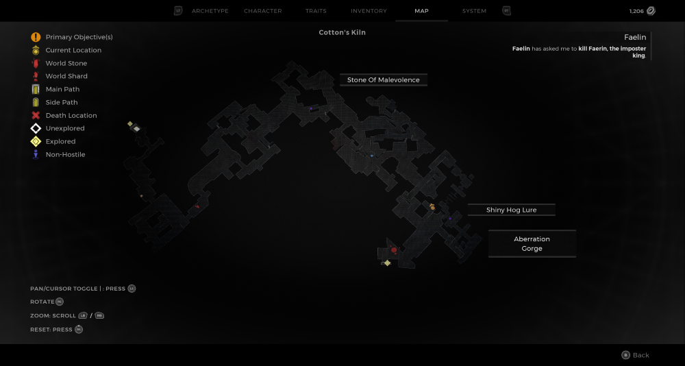

⚠️ Warning ⚠️

If you are linked directly to this instance but don't understand how this works then read the [readme](https://github.com/razeedazee/remnant2-instances/blob/main/README.md)

Info:

- Area name
- Difficulty: Survivor
- Powerlevel: 2

Traits:

- N/A

Random Items Spawns:

- Stone of MaleVolence

Fixed Items spawns:

- N/A

Fixed Items spawns - conditional rewards:

- N/A

Injectables:

- Aberration - Gorge
  - Mutator - Twisting Wounds
  - Shiny Hog Lure

Bosses:

- Gwendil: The Unburnt
  - Alkahest Powder - Crafting Material

Notes:

>

