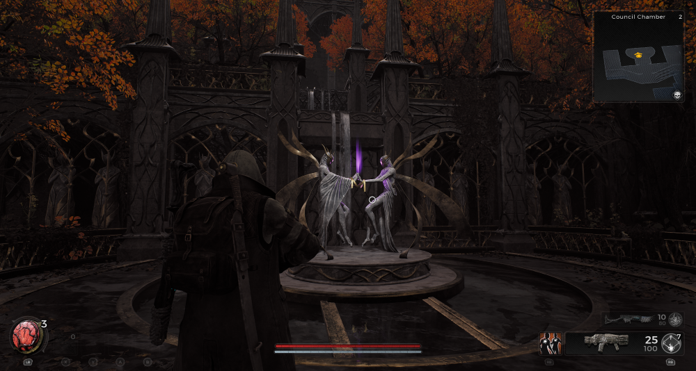
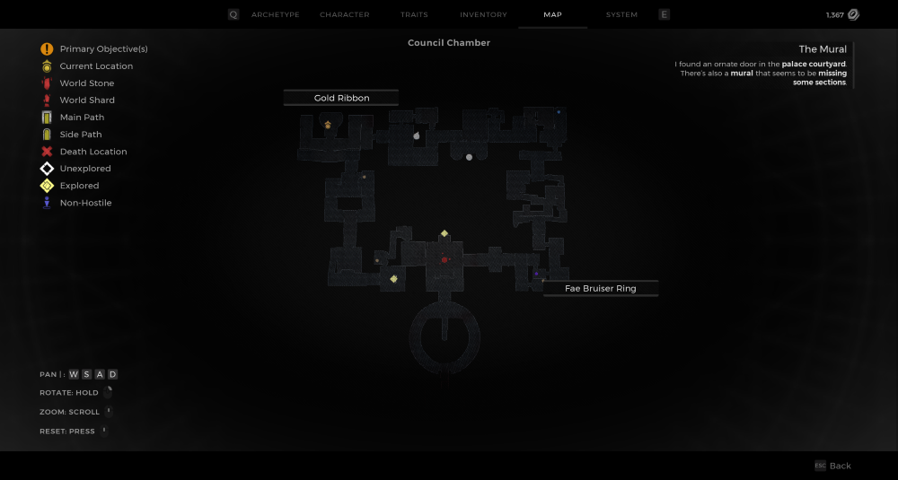
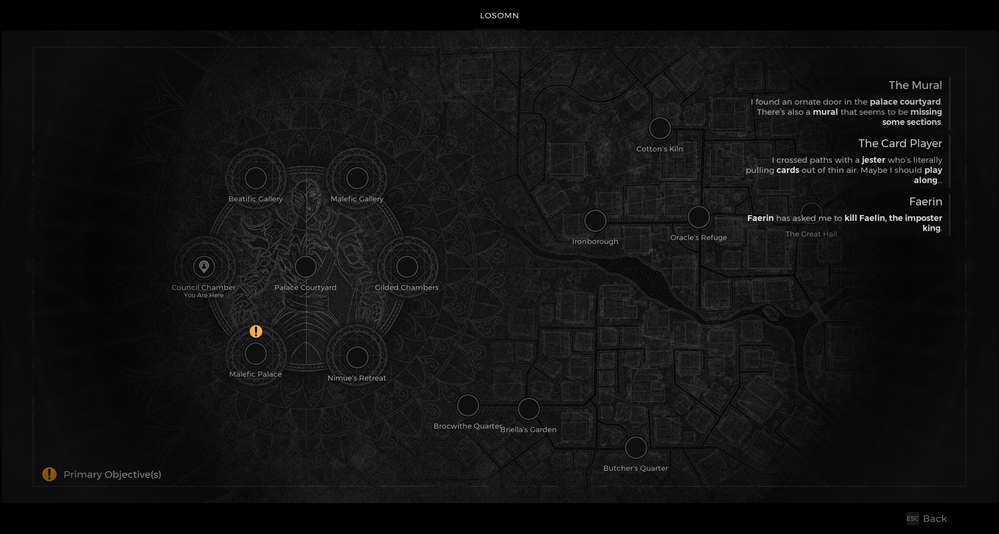

⚠️ Warning ⚠️

If you are linked directly to this instance but don't understand how this works then read the [readme](https://github.com/razeedazee/remnant2-instances/blob/main/README.md)

Info:

- Council Chamber
- Difficulty: Survivor
- Power level: 2
- Checkpoint: Yes

Traits:

- N/A

Random item Spawns:

- Fae Bruiser Ring

Fixed item spawns:

- Assassin's Dagger (collected) (checkpoint)
- Assassin's Band (checkpoint)

Fixed item spawns - conditional rewards:

- Fae Protector Signet - Kill Council Members
- Ornate Blade - Prove Traitor using Dagger

Injectable:

- The Statues
  - Golden Ribbon

Bosses:

- N/A

Checkpoint:

- Council Tribunal
  - Assassin's Dagger (collected)
  - Assassin's Band

Quest items relevant to instance:

- In Inventory
  - Assassin's Dagger
- Interactions
  - Give to the Council to prove accusation or keep it to craft at Nimue

Notes:

>

