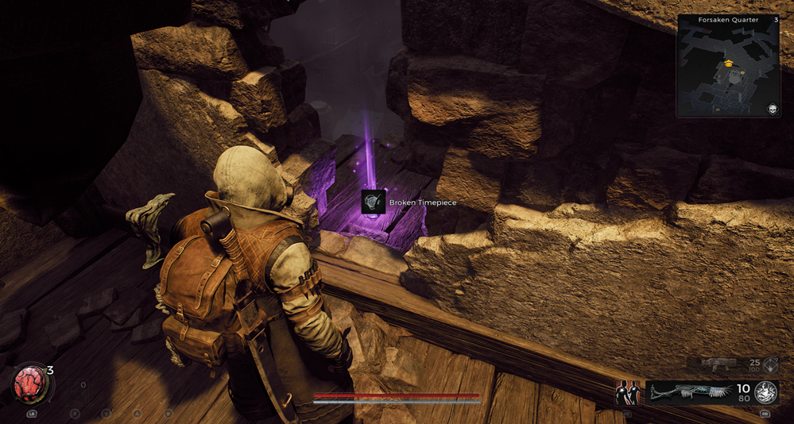

⚠️ Warning ⚠️

If you are linked directly to this instance but don't understand how this works then read the [readme](https://github.com/razeedazee/remnant2-instances/blob/main/README.md)

Info:

- Forsaken Quarter
- Difficulty: Survivor
- Power level: 3
- Checkpoint: No

Traits:

- N/A

Random item Spawns:

- Booster Ring

Fixed item spawns:

- N/A

Fixed item spawns - conditional rewards:

- N/A

Injectable:

- Hewdas Clock
  - Broken Timepiece - repair clock tower and start clock (done)

Bosses:

- N/A

Checkpoint:

- N/A

Quest items relevant to instance:

- In Inventory
  - N/A
- Interactions
  - N/A

Notes:

> Use lift to go to top of clock and get item

