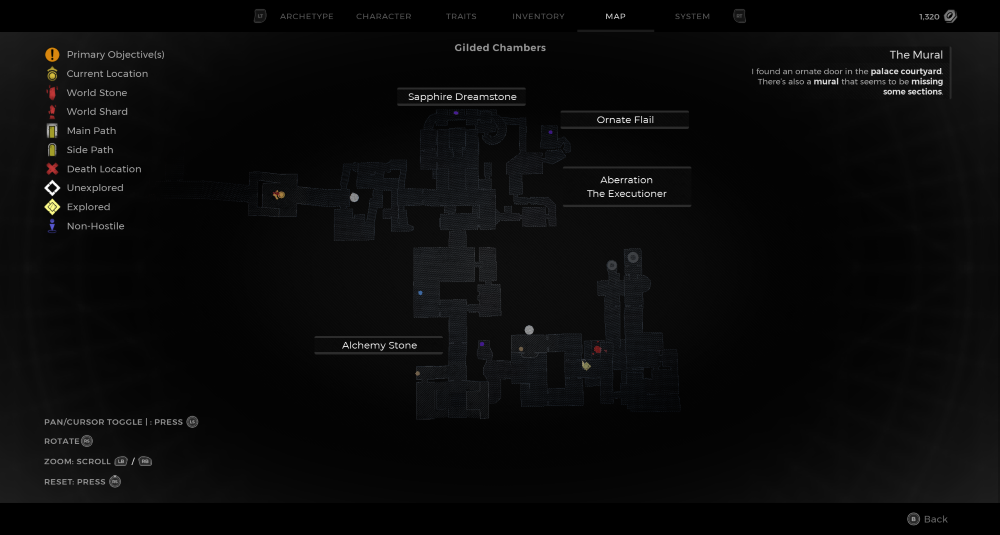
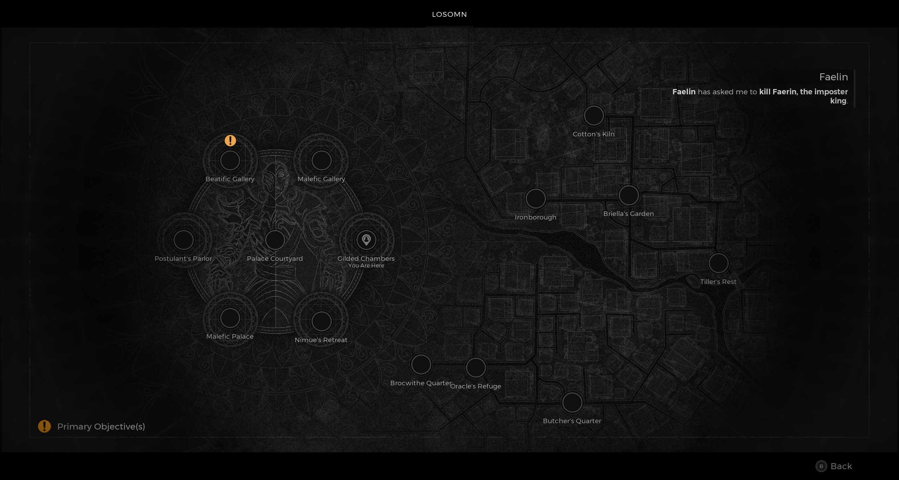

⚠️ Warning ⚠️

If you are linked directly to this instance but don't understand how this works then read the [readme](https://github.com/razeedazee/remnant2-instances/blob/main/README.md)

Info:

- Gilded Chambers
- Difficulty: Survivor
- Power level: 4
- Checkpoint: Yes

Traits:

- N/A

Random item Spawns:

- Alchemy Stone

Fixed item spawns:

- N/A

Fixed item spawns - conditional rewards:

- N/A

Injectable:

- Aberration - The Executioner
  - Mutator - Steadfast
  - Sapphire Dreamstone
  - Ornate Flail

Bosses:

- The Red Prince
  - Forlorn Fragment - Crafting Material
  - Crown of the Red Prince - Armour Head - Get killing blow with the Assassin's Dagger
  - Bloody Steel Splinter - Pay tribute using the 3 coins in your inventory in the dialogue options

Checkpoint:

- Outside Red Prince throne room.

Quest items relevant to instance:

- In Inventory
  - 3 Crimson King Coins - Dialogue option for the Red Prince to get alt kill rewards.
- Interactions
  - N/A

Notes:

> - Checkpoint is fastest for Red Prince and Aberration.
> - No Council Chamber in this instance. Must have Assassan's Dagger weapon already

