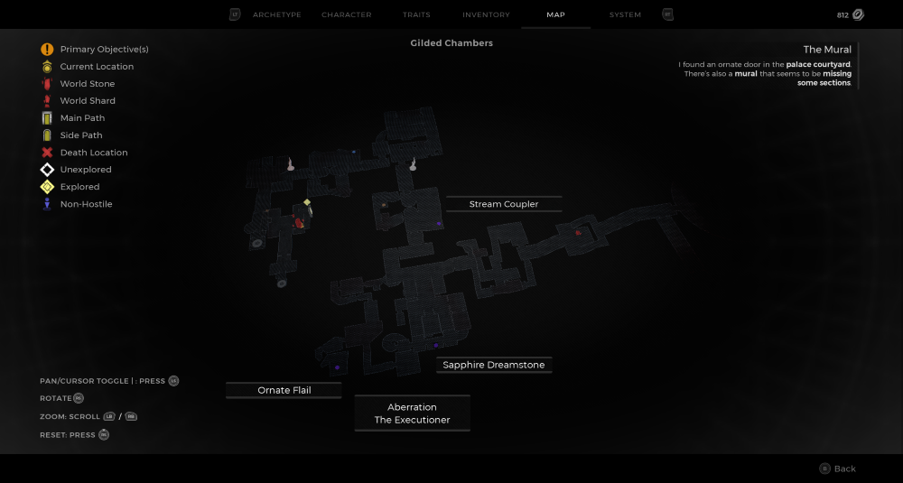

⚠️ Warning ⚠️

If you are linked directly to this instance but don't understand how this works then read the [readme](https://github.com/razeedazee/remnant2-instances/blob/main/README.md)

Info:

- Gilded Chambers
- Difficulty: Survivor
- Power level:4
- Checkpoint: Yes

Traits:

- N/A

Random Items Spawns:

- Stream Coupler

Fixed Items spawns:

- N/A

Fixed Items spawns - conditional rewards:

- Crown of the Red Prince - Get killing blow with the Assassin's Dagger
- Bloody Steel Splinter - Pay tribute using the 3 coins in your inventory in the dialogue options

Injectables:

- Aberration - The Executioner
  - Mutator - Steadfast
  - Sapphire Dreamstone
  - Ornate Flail

Bosses:

- The Red Prince

Checkpoint:

- Outside Red Prince throne room.

Quest Items:

- In Inventory
  - 3 Crimson King Coins - Dialogue option for the Red Prince to get alt kill rewards.
  - Assassin's Dagger - Crafting Material for Nimue
- Interactions
  - Travel to Nimue's Retreat via World Stone to craft Assassin's Dagger into weapon to last hit Red Prince

Notes:

>

