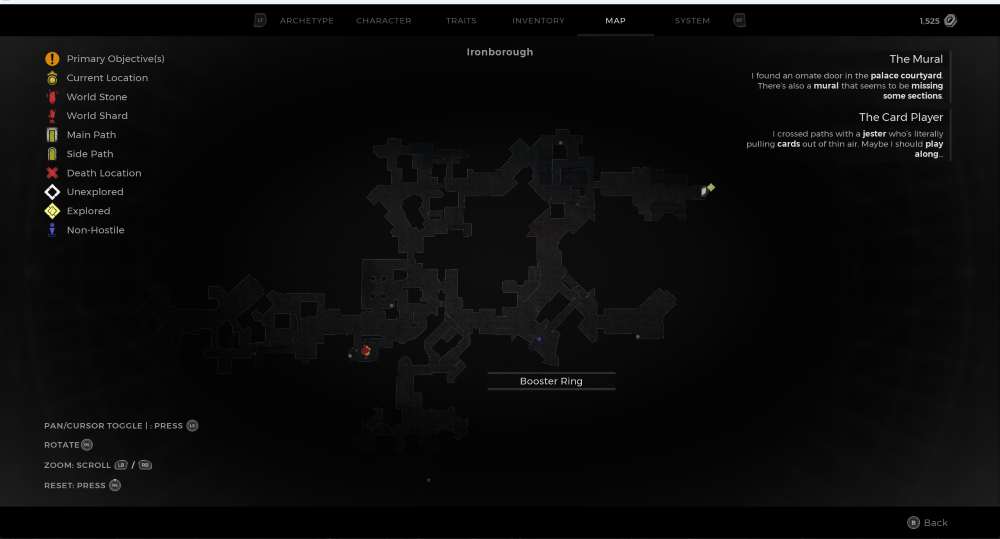
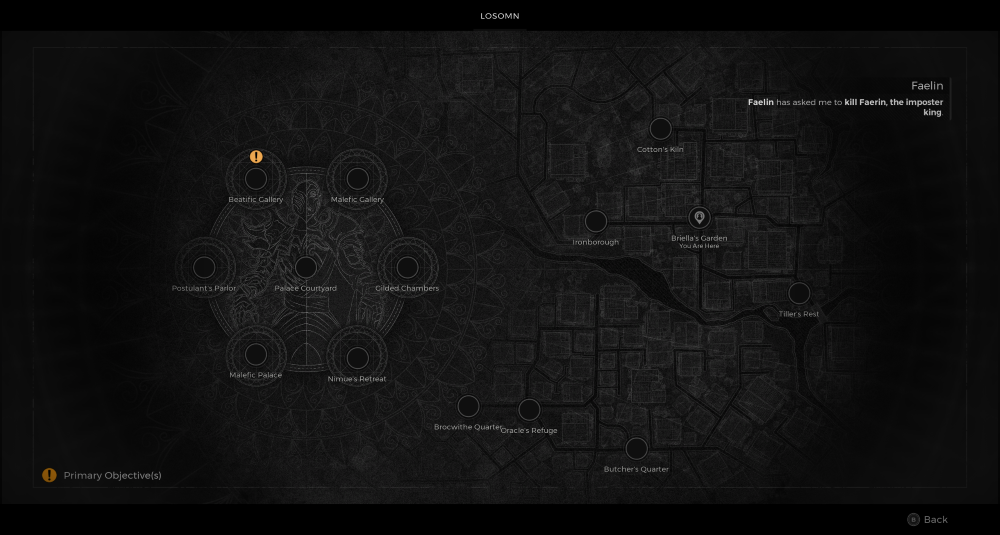

⚠️ Warning ⚠️

If you are linked directly to this instance but don't understand how this works then read the [readme](https://github.com/razeedazee/remnant2-instances/blob/main/README.md)

Info:

- Briella's Garden
- Difficulty: Survivor
- Power level: 3

Traits:

- N/A

Random Items Spawns:

- Booster Ring

Fixed Items spawns:

- N/A

Fixed Items spawns - conditional rewards:

- Huntress Dream - Hit Sleeping Huntress with Dreamcatcher

Injectables:

- N/A

Bosses:

- The Huntress
  - Venerated Spearhead
  - Sacred Hunt Feather

Notes:

> To make the Huntress sleep, use liquid escape. She will be sleeping when you respawn.

