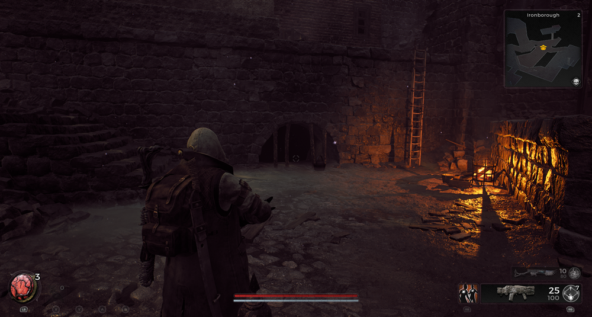
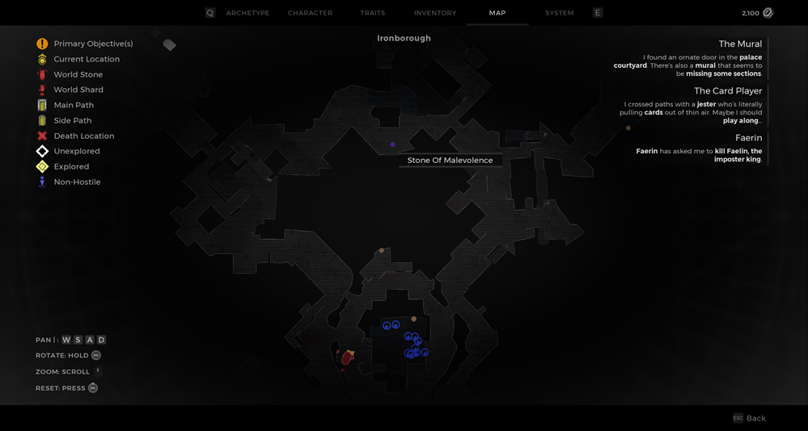
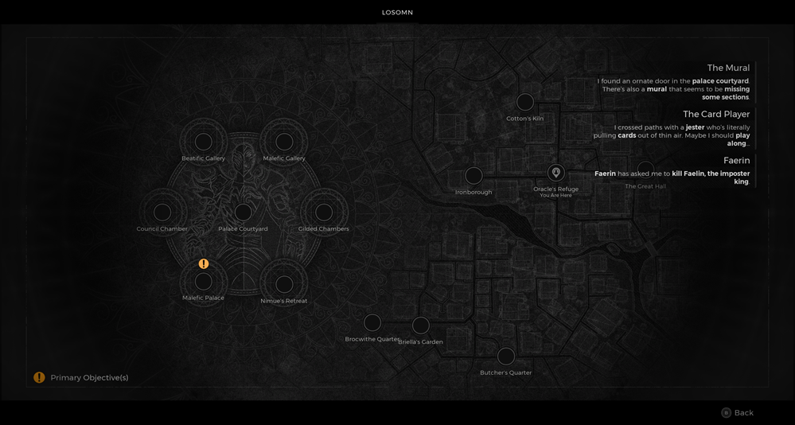

⚠️ Warning ⚠️

If you are linked directly to this instance but don't understand how this works then read the [readme](https://github.com/razeedazee/remnant2-instances/blob/main/README.md)

Info:

- Ironborough
- Difficulty: Survivor
- Power level: 2
- Checkpoint: No

Traits:

- N/A

Random item Spawns:

- Stone of Malevolence

Fixed item spawns:

- N/A

Fixed item spawns - conditional rewards:

- N/A

Injectable:

- Monster in the Drain
  - Philosopher's Stone

Bosses:

- N/A

Checkpoint:

- N/A

Quest items relevant to instance:

- In Inventory
  - N/A
- Interactions
  - N/A

Notes:

> The monster in drain can be triggered in the area around the Stone of Malevolence. Just run round from the World Stone.

