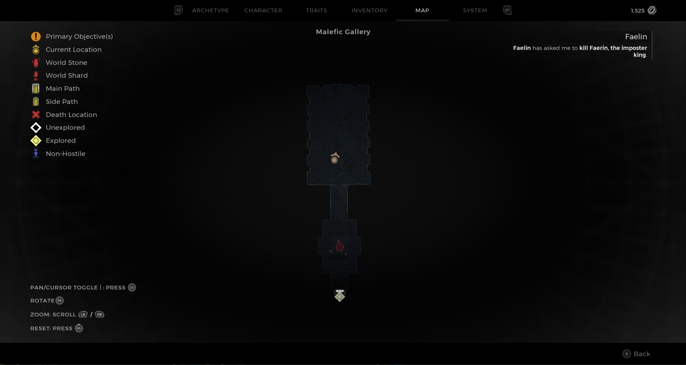
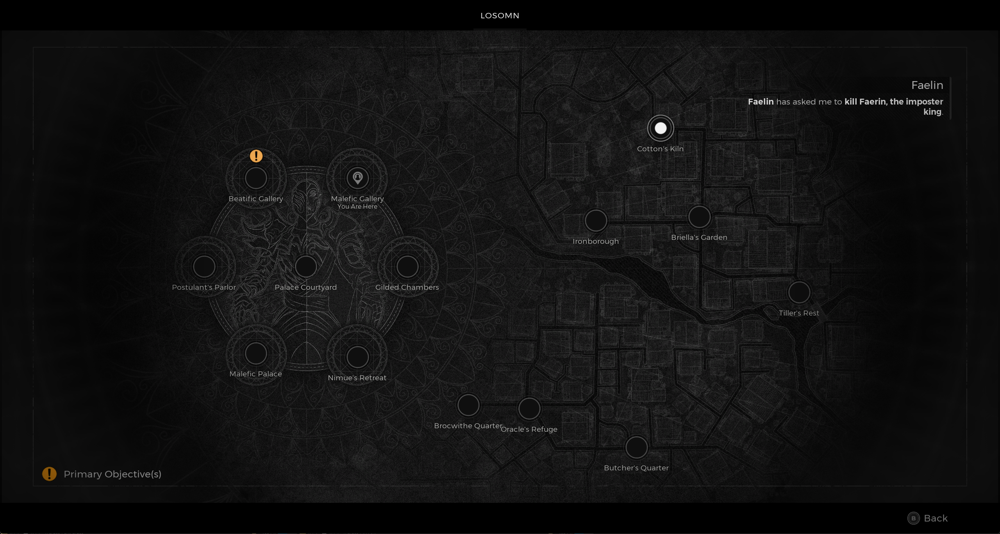

⚠️ Warning ⚠️

If you are linked directly to this instance but don't understand how this works then read the [readme](https://github.com/razeedazee/remnant2-instances/blob/main/README.md)

Info:

- Malefic Gallery
- Difficulty: Survivor
- Powerlevel: 5

Traits:

- N/A

Random Items Spawns:

- N/A

Fixed Items spawns:

- N/A

Fixed Items spawns - conditional rewards:

- Faelin's Sigil - Return to Faelin after killing Faerin (see Faelin Sigil instance)

Injectables:

- N/A

Bosses:

- Faerin

Notes:

>

