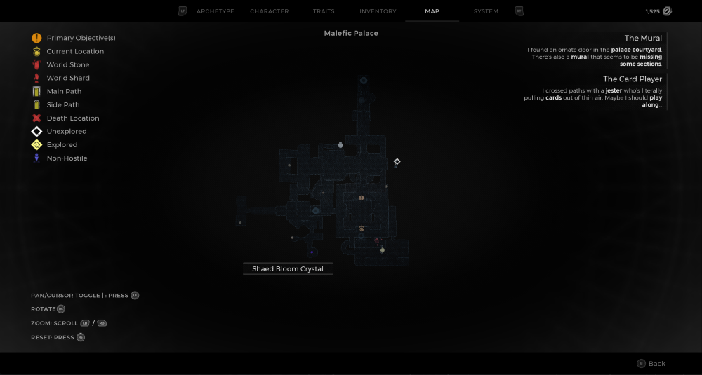

⚠️ Warning ⚠️

If you are linked directly to this instance but don't understand how this works then read the [readme](https://github.com/razeedazee/remnant2-instances/blob/main/README.md)

Info:

- Malefic Palace - Jester card game
- Difficulty: Survivor
- Powerlevel: 3

Traits:

- N/A

Random Items Spawns:

- N/A

Fixed Items spawns:

- N/A

Fixed Items spawns - conditional rewards:

- Aberration - Firth: The Oath Keeper - Daemon Card
  - Mutator - Misfortune
- One-Eye Joker Idol - Joker Card

Injectables:

- N/A

Bosses:

- N/A

Notes:

> Play the card game to get the doors you need.

