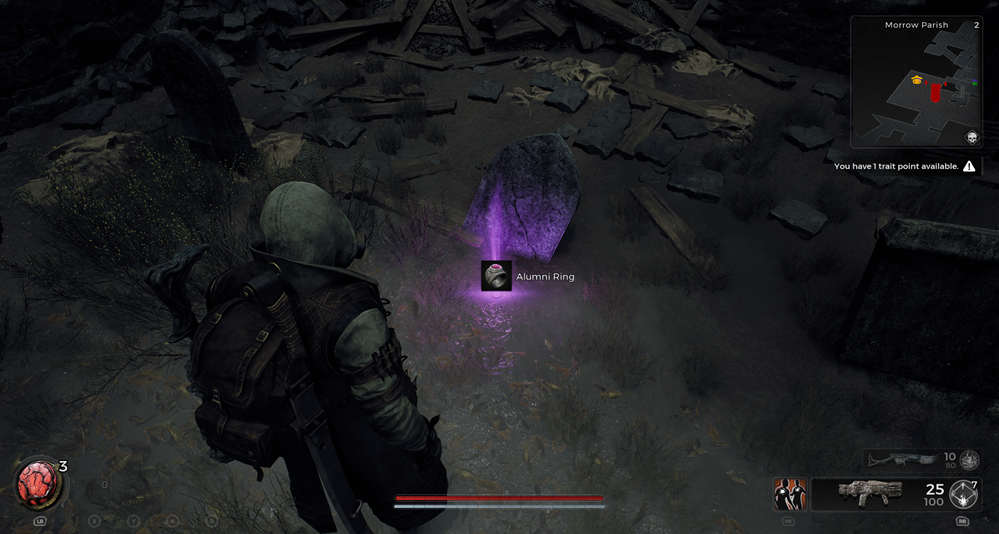
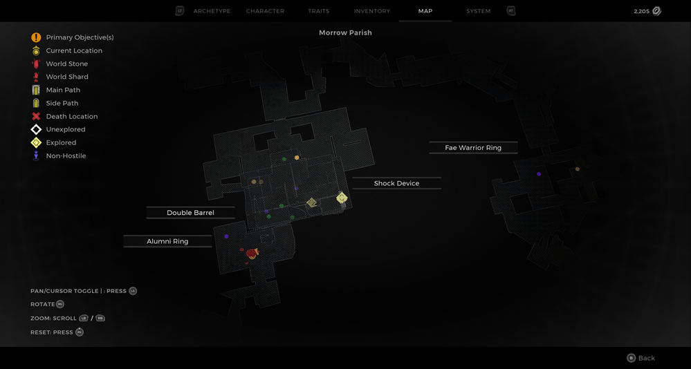
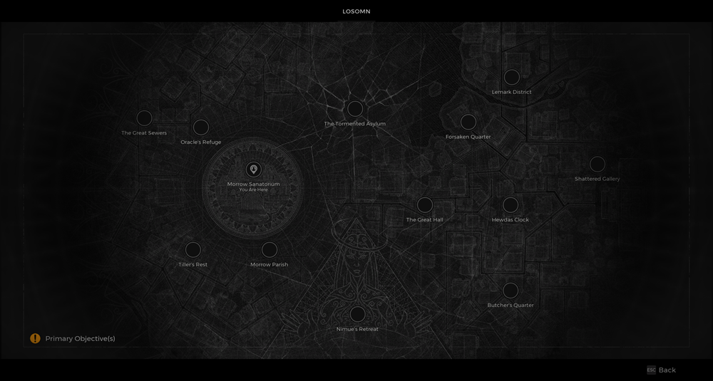

⚠️ Warning ⚠️

If you are linked directly to this instance but don't understand how this works then read the [readme](https://github.com/razeedazee/remnant2-instances/blob/main/README.md)

Info:

- Area: Morrow Parish
- Sub Area: Morrow Sanatorium
- Difficulty: Survivor
- Power level: 2
- Checkpoint: Yes/No

Traits:

- N/A

Random item Spawns:

- Fae Warrior Ring

Fixed item spawns:

- Shock Device

Fixed item spawns - conditional rewards:

- Double Barrel - Locked safe
- Alumni Ring (Kill Nightweaver - Done)

Injectable:

- N/A

Bosses:

- N/A

Checkpoint:

- N/A

Quest items relevant to instance:

- In Inventory
  - N/A
- Interactions
  - N/A

Notes:

> Safe combination is always 2971

