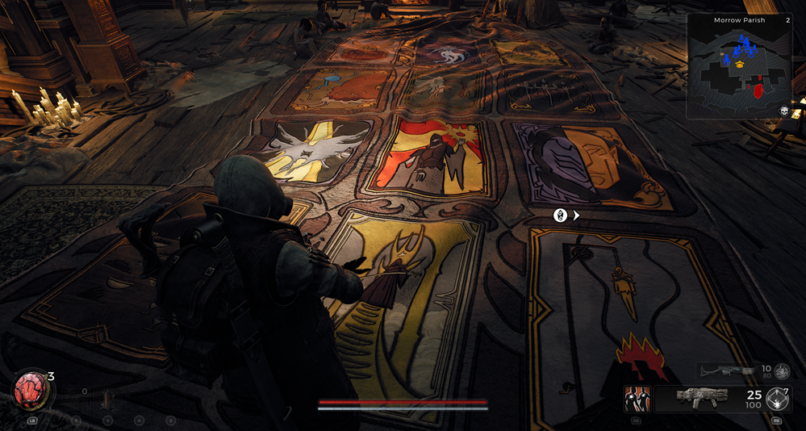

⚠️ Warning ⚠️

If you are linked directly to this instance but don't understand how this works then read the [readme](https://github.com/razeedazee/remnant2-instances/blob/main/README.md)

Info:

- Morrow Parish
  - Oracle's Refuge
- Difficulty: Survivor
- Power level: 3
- Checkpoint: No

Traits:

- Recovery - Speak to Oracle

Random item Spawns:

- Fae Warrior Ring

Fixed item spawns:

- N/A

Fixed item spawns - conditional rewards:

- Quilted Heart - Speak to Oracle
- All-Seeing Eye - Speak to Oracle

Injectable:

- Oracle of Dran
  - Trait - Recovery
  - Relic - Quilted Heart
  - All-Seeing Eye.

Bosses:

- N/A

Checkpoint:

- N/A

Quest items relevant to instance:

- In Inventory
  - N/A
- Interactions
  - N/A

Notes:

> Speak to Oracle until you receive all items.

