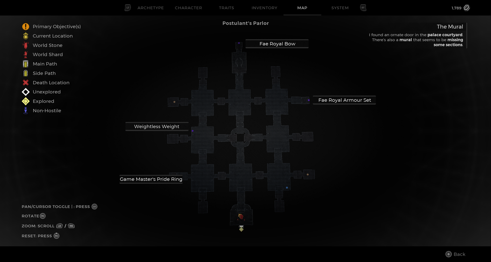
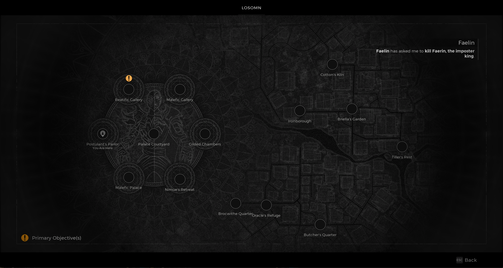

⚠️ Warning ⚠️

If you are linked directly to this instance but don't understand how this works then read the [readme](https://github.com/razeedazee/remnant2-instances/blob/main/README.md)

Info:

- Postulent Parlour
- Difficulty: Survivor
- Powerlevel: 2

Traits:

- N/A

Random Items Spawns:

- Weightless Weight

Fixed Items spawns:

- N/A

Fixed Items spawns - conditional rewards:

- Fae Royal Bow - Solve Game Master's Puzzle. (Done)
- Game Master's Pride Ring - Coop Puzzle
- Fae Armour Set - Unlock top right with clear path to top right square

Injectables:

- N/A

Bosses:

- N/A

Notes:

>

