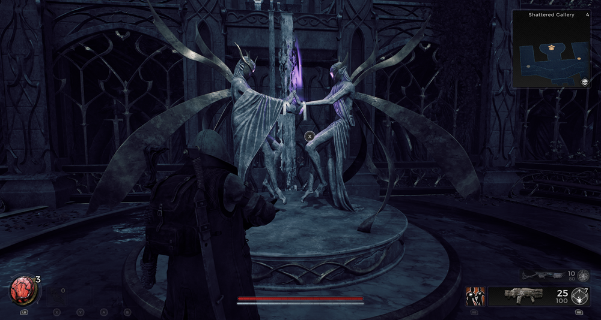

⚠️ Warning ⚠️

If you are linked directly to this instance but don't understand how this works then read the [readme](https://github.com/razeedazee/remnant2-instances/blob/main/README.md)

Info:

- Shattered Gallery
- Difficulty: Survivor
- Power level: 4
- Checkpoint: Yes

Traits:

- N/A

Random item Spawns:

- Chains of Amplification

Fixed item spawns:

- N/A

Fixed item spawns - conditional rewards:

- N/A

Injectable:

- The Statues
  - Silver Ribbon

Bosses:

- Magister Dullain
  - Taited Ichor - Crafting Material > Weapon Mod - Corrosive Rounds

Checkpoint:

- Magister Dullain

Quest items relevant to instance:

- In Inventory
  - N/A
- Interactions
  - N/A

Notes:

> - Silver Ribbon is ready to collect.
>
> - Start at checkpoint to fight Magister Dullain

