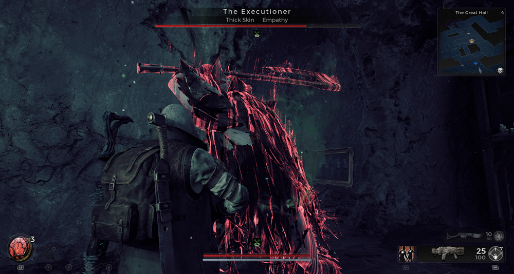
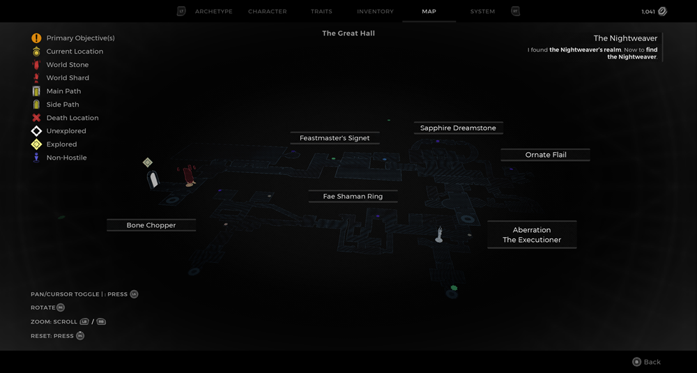
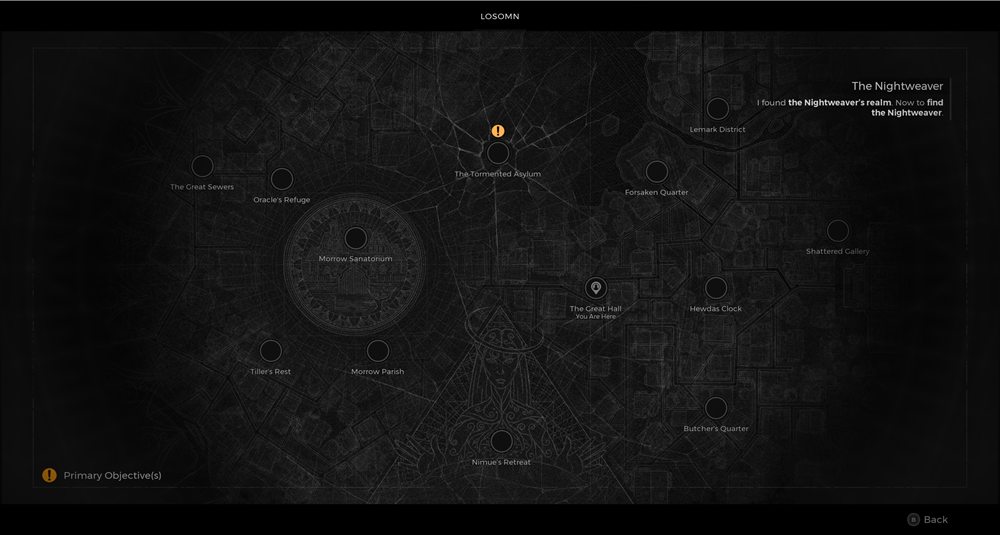

⚠️ Warning ⚠️

If you are linked directly to this instance but don't understand how this works then read the [readme](https://github.com/razeedazee/remnant2-instances/blob/main/README.md)

Info:

- The Great Hall
- Difficulty: Survivor
- Power level: 4
- Checkpoint: No

Traits:

- Gluttonous

Random item Spawns:

- Faw Shaman Ring

Fixed item spawns:

- Feastmaster's Signet

Fixed item spawns - conditional rewards:

- Bone Chopper (go down dolly after event)

Injectable:

- Aberration - The Executioner
  - Mutator - Steadfast
  - Sapphire Dreamstone
  - Ornate Flail

Bosses:

- N/A

Checkpoint:

- N/A

Quest items relevant to instance:

- In Inventory
  - N/A
- Interactions
  - N/A

Notes:

>

