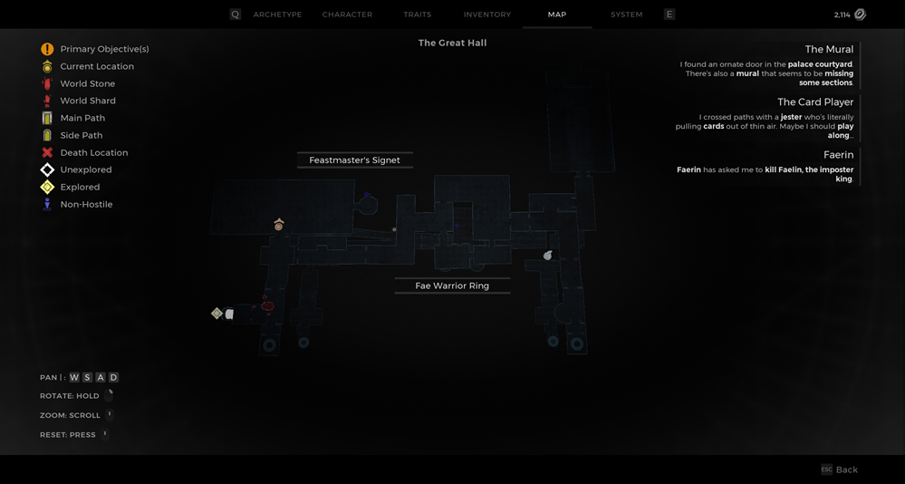

⚠️ Warning ⚠️

If you are linked directly to this instance but don't understand how this works then read the [readme](https://github.com/razeedazee/remnant2-instances/blob/main/README.md)

Info:

- The Great Hall
- Difficulty: Survivor
- Power level: 2
- Checkpoint: No

Traits:

- Glutton - Eat a downed coop player during the Feat Event

Random item Spawns:

- Fae Warrior Ring

Fixed item spawns:

- N/A

Fixed item spawns - conditional rewards:

- Bone Chopper - Complete Feast Event and go down dumb waiters behind NPC

Injectable:

- The Flames
  - White Pawn Stamp - Shoot lights so they are all white
  - Black Pawn Stamp - Shoot lights so they are all black

Bosses:

- N/A

Checkpoint:

- N/A

Quest items relevant to instance:

- In Inventory
  - N/A
- Interactions
  - N/A

Notes:

> - The Ravenous Medallion was used to open the door as there is no Web in this instance
>
> - For flames, shoot every second flame to easily solve puzzle.

