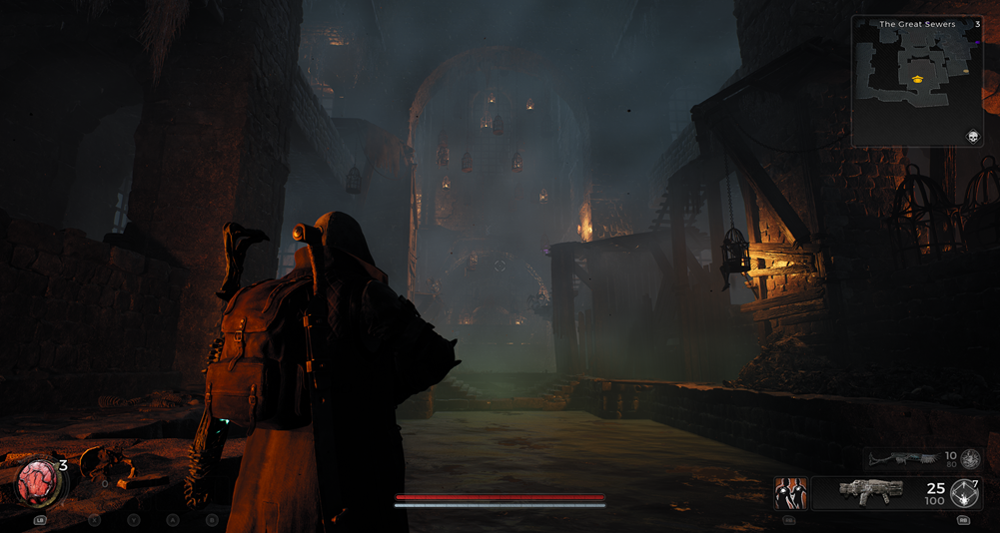
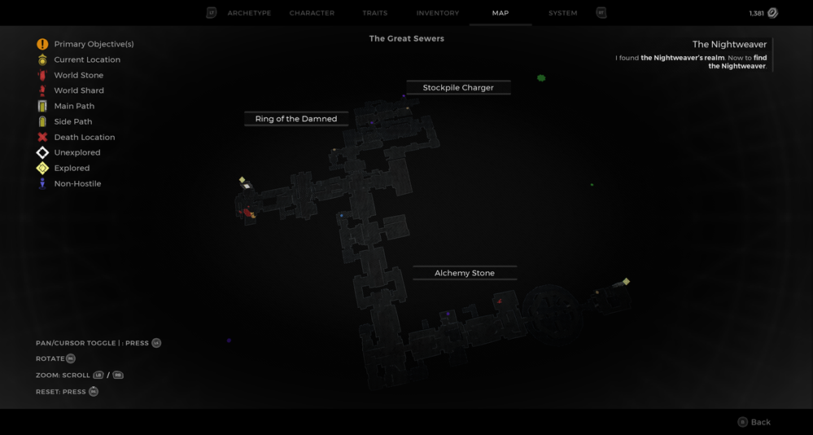
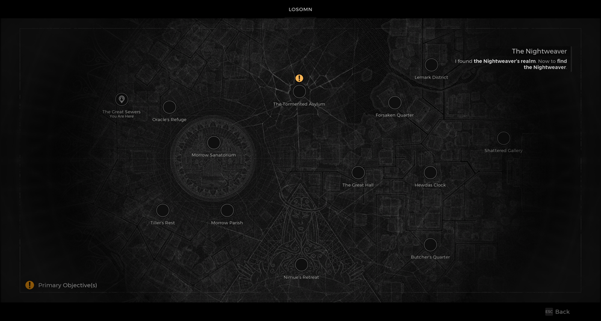

⚠️ Warning ⚠️

If you are linked directly to this instance but don't understand how this works then read the [readme](https://github.com/razeedazee/remnant2-instances/blob/main/README.md)

Info:

- The Great Sewers
- Difficulty: Survivor
- Power level: 3
- Checkpoint: Yes

Traits:

- N/A

Random item Spawns:

- Alchemy Stone

Fixed item spawns:

- N/A

Fixed item spawns - conditional rewards:

- N/A

Injectable:

- The Nest
  - Stockpile Charger
  - Ring of the Damned (Dran Corpse)

Bosses:

- Great Bloat

Checkpoint:

- Great Bloat

Quest items relevant to instance:

- In Inventory
  - N/A
- Interactions
  - N/A

Notes:

> Load Checkpoint for Great Bloat

