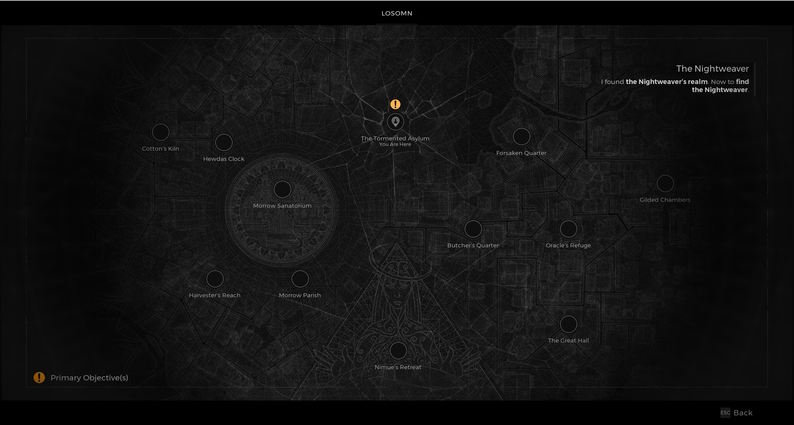

⚠️ Warning ⚠️

If you are linked directly to this instance but don't understand how this works then read the [readme](https://github.com/razeedazee/remnant2-instances/blob/main/README.md)

Info:

- The Tormented Asylum - The Nightweaver's web
- Difficulty: Survivor
- Powerlevel: 21

Traits:

- N/A

Random Items Spawns:

- N/A

Fixed Items spawns:

- N/A

Fixed Items spawns - conditional rewards:

- Ring of Retribution (Dria's Anklet)
- Nightweaver's Grudge (Kolket's Razor)
- Decrepit Rune - Ravenous Medallion
- Tormented Heart (Override Pin)
- Dreamcatcher - (Knightweaver Stoen Doll)

Injectables:

- N/A

Bosses:

- N/A

Notes:

> You can go Nimue from World Stone to craft Decrepit Rune into Rune pistol

