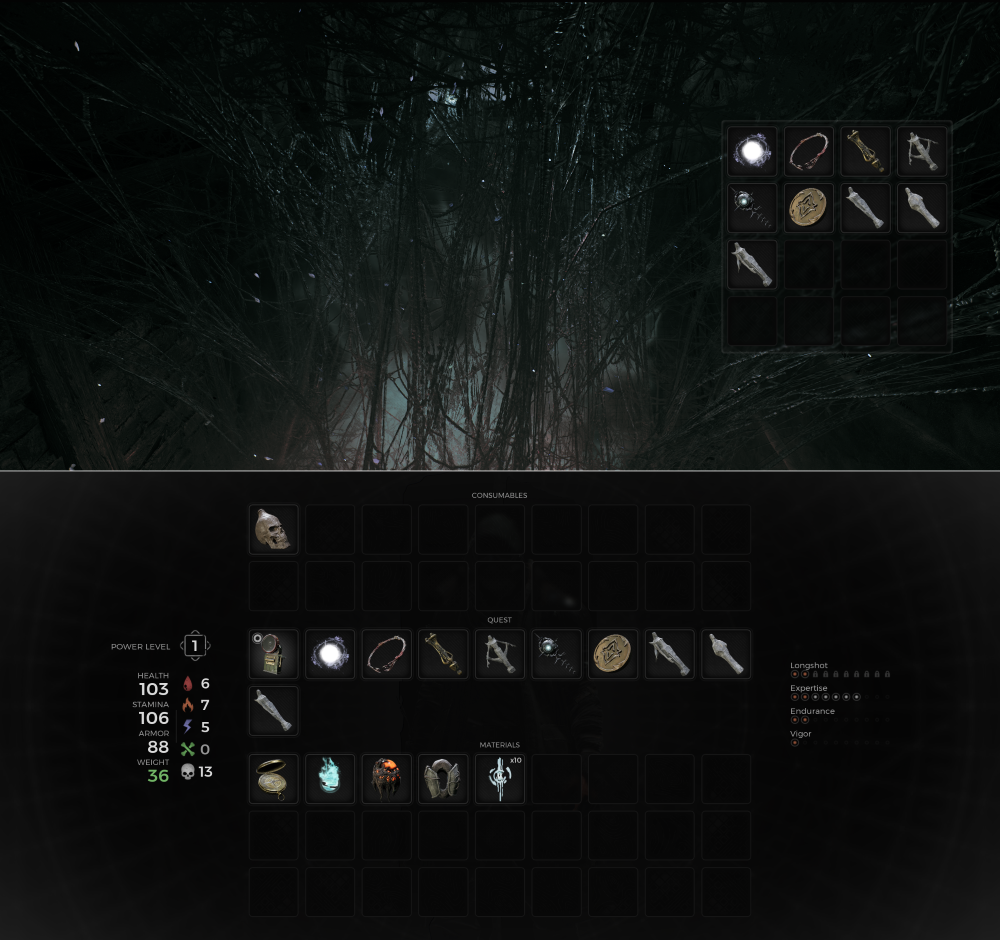
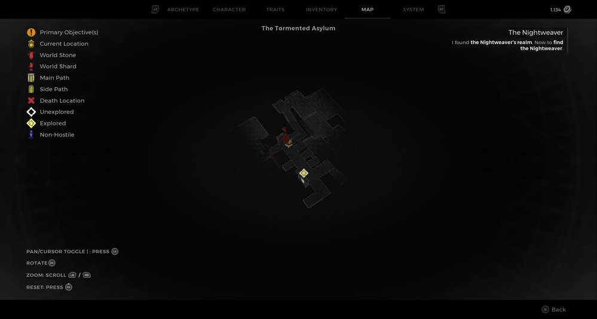
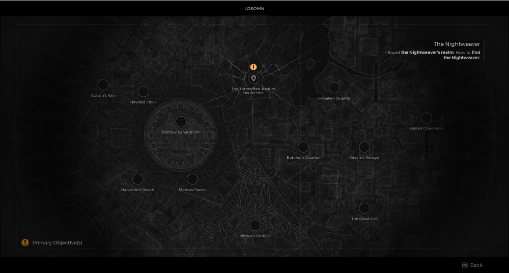

⚠️ Warning ⚠️

If you are linked directly to this instance but don't understand how this works then read the [readme](https://github.com/razeedazee/remnant2-instances/blob/main/README.md)

Info:

- The Tormented Asylum - The Nightweaver's web
- Difficulty: Survivor
- Power level: 21
- Checkpoint: No

Traits:

- N/A

Random item Spawns:

- N/A

Fixed item spawns:

- N/A

Fixed item spawns - conditional rewards:

- Ring of Retribution (Web - Dria's Anklet)
- Nightweaver's Grudge (Web - Kolket's Razor)
- Decrepit Rune - (Web - Ravenous Medallion)
- Tormented Heart (Web - Override Pin)
- Dreamcatcher - (Web - Knightweaver Stone Doll)
- Tranquil Heart - (Nimue - Tormented Heart)
- Rune pistol - (Nimue - Decrepit Rune)

Injectable:

- N/A

Bosses:

- Nightweaver
  - Cursed Dream Silks
  - Nightweaver's Finger (alt kill) - destroy heart and don't get grabbed in second phase0

Checkpoint:

- N/A

Quest items relevant to instance:

- In Inventory
  - Dria's Anklet
  - Kolket's Razor
  - Ravenous Medallion
  - Override Pin
  - Knightweaver Stone Doll
- Interactions
  - Give these items to the web to get
    - Ring of Retribution (Dria's Anklet)
    - Nightweaver's Grudge (Kolket's Razor)
    - Decrepit Rune - Ravenous Medallion
    - Tormented Heart (Override Pin)
    - Dreamcatcher - (Knightweaver Stone Doll)

Notes:

> - You can go Nimue from World Stone to:
>
>   - Decrepit Rune into Rune pistol
>   - Tormented Heart into Tranquil Heart
>
> - You can reload the save to get the Tormented Heart after crafting it into Tranquil

