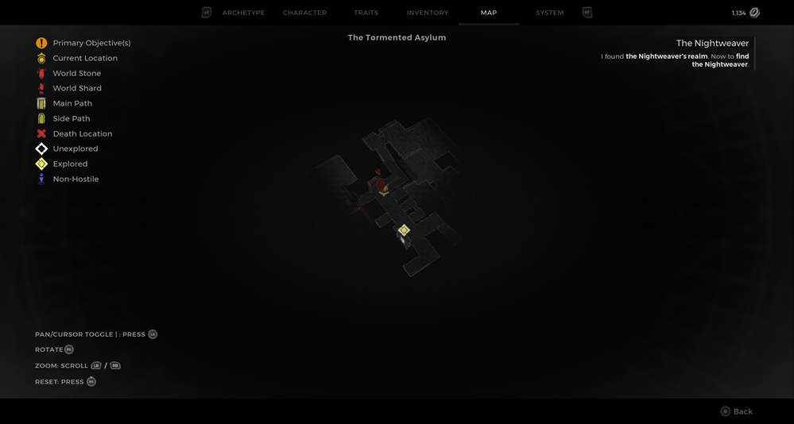
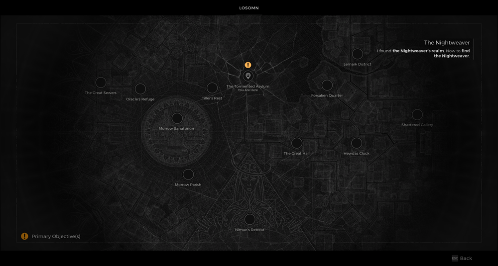

⚠️ Warning ⚠️

If you are linked directly to this instance but don't understand how this works then read the [readme](https://github.com/razeedazee/remnant2-instances/blob/main/README.md)

Info:

- The Tormented Asylum - The Nightweaver's web
- Difficulty: Survivor
- Power level: 5
- Checkpoint: No

Traits:

- N/A

Random item Spawns:

- N/A

Fixed item spawns:

- N/A

Fixed item spawns - conditional rewards:

- Decrepit Rune - (Web - Ravenous Medallion)
- Dreamcatcher - (Web - Knightweaver Stone Doll)

Injectable:

- N/A

Bosses:

- Nightweaver
  - Cursed Dream Silks
  - Nightweaver's Finger (alt kill) - destroy heart and don't get grabbed in second phase0

Checkpoint:

- N/A

Quest items relevant to instance:

- In Inventory
  - Dreamcatcher - (Knightweaver Stone Doll)
  - Ravenous Medallion
- Interactions
  - Dreamcatcher - (Knightweaver Stone Doll)
  - Decrepit Rune - Ravenous Medallion

Notes:

> - You can go Nimue from World Stone to:
>
>   - Decrepit Rune into Rune pistol

