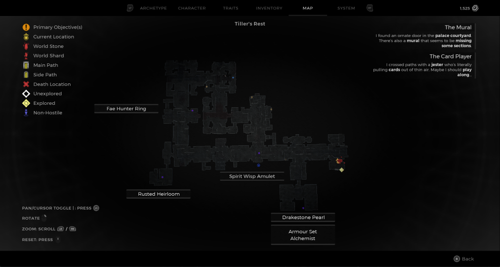
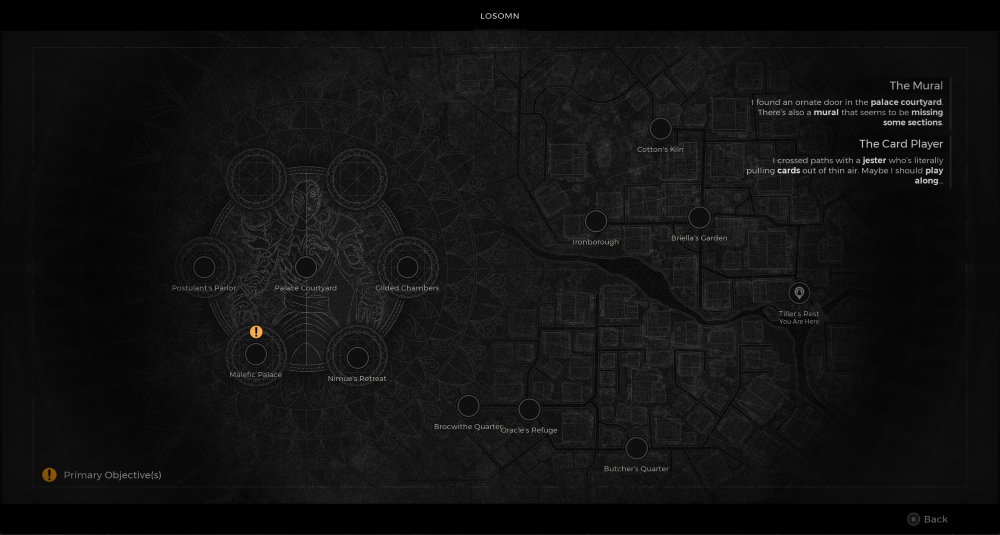

⚠️ Warning ⚠️

If you are linked directly to this instance but don't understand how this works then read the [readme](https://github.com/razeedazee/remnant2-instances/blob/main/README.md)

Info:

- Tiller's Rest
- Difficulty: Survivor
- Powerlevel: 1/5

Traits:

- N/A

Random Items Spawns:

- Fae Hunter Ring

Fixed Items spawns:

- Spirit Wisp Amulet

Fixed Items spawns - conditional rewards:

- Outcast Ring - Give the Spirit Wisp Amulet to the npc behind the bars

Injectables:

- Locked Safe
  - Rusted Heirloom

Bosses:

- N/A

Notes:

> Safe code is `5813`
> You can jump into tunnel where the Alchemist armour set and Drakestone Pearl ring is. You have to jump into the edge of the wooden beams and they nudge you forward to make the jump. Go left in the area to make the monster spawn which you kill for the Drakestone Pearl ring. Then collect the armour.

