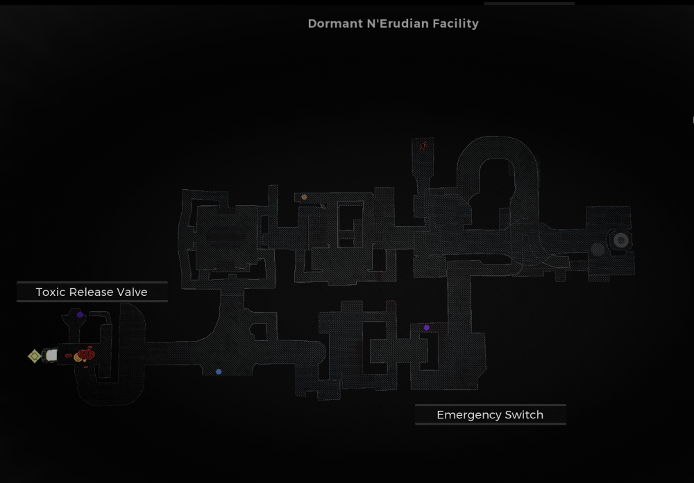

⚠️ Warning ⚠️

If you are linked directly to this instance but don't understand how this works then read the [readme](https://github.com/razeedazee/remnant2-instances/blob/main/README.md)

Info:

- Difficulty: Survivor
- Power level: 4

Traits:

- Siphoner  - Purge Facility
- Resonance - Be Purged while in Facility by coop player

Random Items Spawns:

- Emergency Switch

Fixed Items spawns:

- Toxic release valve

Fixed Items spawns - conditional rewards:

- Mutator - Failsafe - Purge Facility and kill aberration S.D. 0A7

Injectables:

- N/A

Bosses:

- Aberration: S.D. 0A7

Notes:

>

