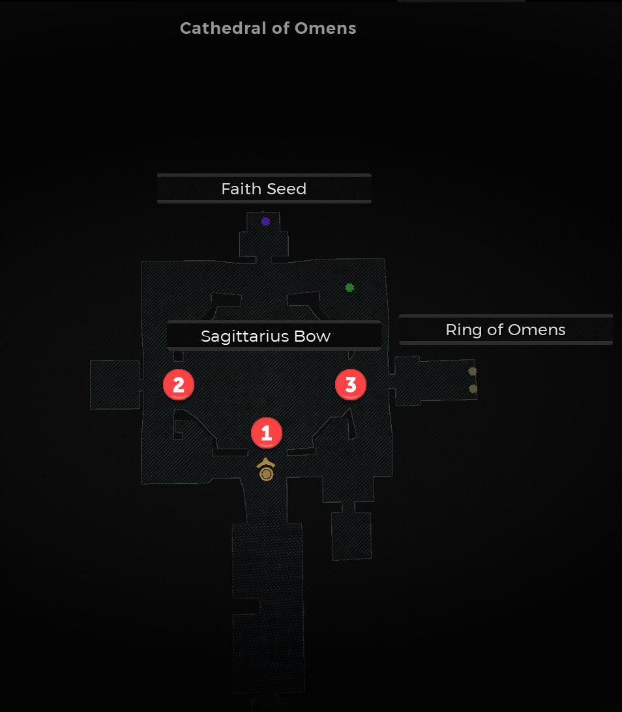
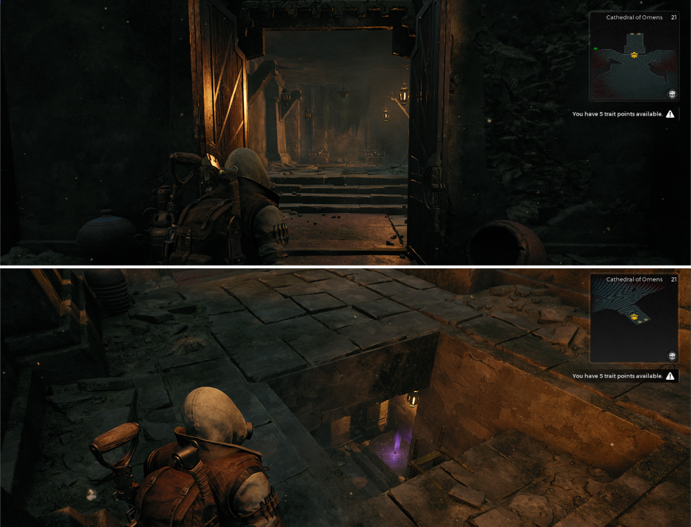

⚠️ Warning ⚠️

If you are linked directly to this instance but don't understand how this works then read the [readme](https://github.com/razeedazee/remnant2-instances/blob/main/README.md)

Info:

- Difficulty: Survivor
- Powerlevel: N/A

Traits:

- N/A

Random Items Spawns:

- N/A

Fixed Items spawns:

- N/A

Fixed Items spawns - conditional rewards:

- Faith Seed
- Ring of Omens
- Sagittarius Bow

Injectables:

- N/A

Bosses:

- N/A

Notes:

> The Ring of Omens Door and bloodmoon trap door is open.

> The Sagittarius Bow is exposed and ready to collect

> From a loaded Save where the puzzle always defaults to the same place the soltions are (see minimap image for numbered locations)
>
> - Sagittarius Bow = 1x4 2x2 3x2
> - Top door = 1x3 2x5 3x1
> - Right door = 1x1 2x0 3 x 4

