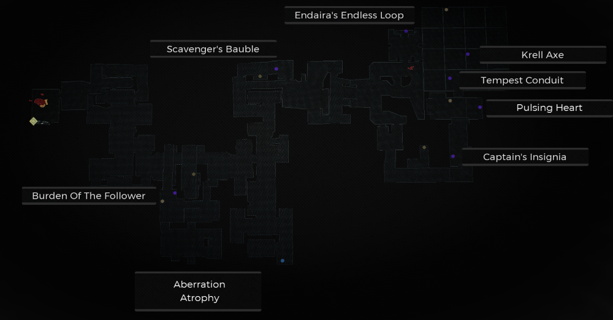

⚠️ Warning ⚠️

If you are linked directly to this instance but don't understand how this works then read the [readme](https://github.com/razeedazee/remnant2-instances/blob/main/README.md)

Info:

- Difficulty: Survivor
- Powerlevel: 4

Traits:

- N/A

Random Items Spawns:

- Scavenger's Bauble

Fixed Items spawns:

- Endaira's Endless Loop
- Tempest Conduit
- Krell Axe
- Captain's Insignia
- Relic - Pulsing Heart

Fixed Items spawns - conditional rewards:

- Captain's Insignia

Injectables:

- Aberration Atrophy
  - Burden of the Follower
  - Mutator - Bulletweaver

Bosses:

- N/A

Notes:

>

