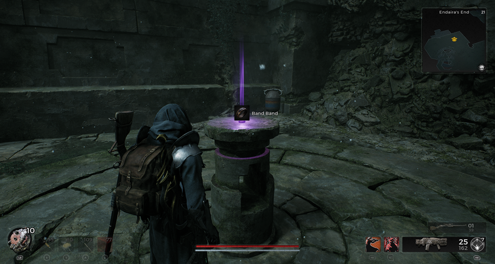
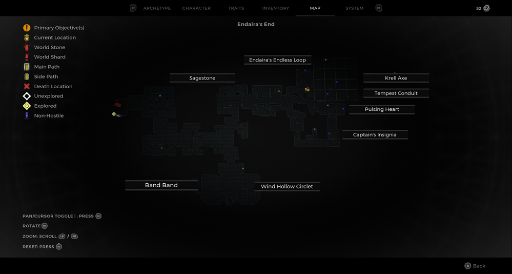

⚠️ Warning ⚠️

If you are linked directly to this instance but don't understand how this works then read the [readme](https://github.com/razeedazee/remnant2-instances/blob/main/README.md)

Info:

- Endaira's End
- Difficulty: Veteran
- Power level: 21
- Checkpoint: Yes

Traits:

- N/A

Random item Spawns:

- Sage Stone

Fixed item spawns:

- Endaira's Endless Loop
- Tempest Conduit
- Krell Axe
- Relic - Pulsing Heart

Fixed item spawns - conditional rewards:

- Captain's Insignia - unsolved - requires 1 coop player to hold pressure plate open

Injectable:

- Flute Tower
  - Wind Hollow Circlet ring - solved - play notes in correct order at flute tower
  - Band Band - solved - requires one additional coop player to solve flute tower

Bosses:

- N/A

Checkpoint:

- Maze

Quest items relevant to instance:

- In Inventory
  - N/A
- Interactions
  - N/A

Notes:

> The Flute tower puzzle is completelt solved. You just collect items.

