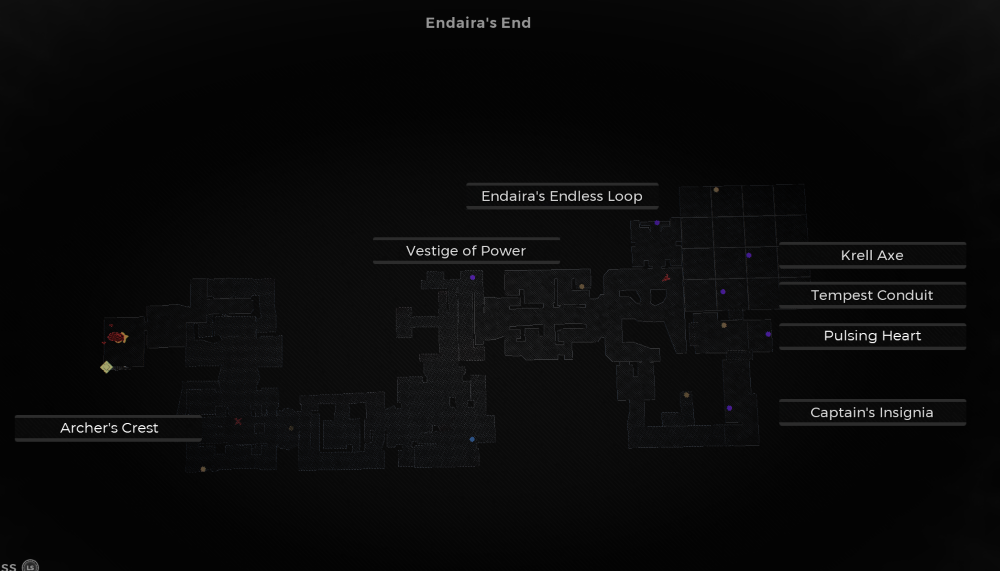

⚠️ Warning ⚠️

If you are linked directly to this instance but don't understand how this works then read the [readme](https://github.com/razeedazee/remnant2-instances/blob/main/README.md)

Info:

- Difficulty: Survivor
- Powerlevel: 1/5

Traits:

- N/A

Random Items Spawns:

- Vestige of Power

Fixed Items spawns:

- Endaira's Endless Loop
- Krell Axe
- Tempest Conduit
- Relic - Pulsing Heart

Fixed Items spawns - conditional rewards:

- Captain's Isignia - Requires Coop to open pressure plate

Injectables:

- Hidden Chamber
  - Archer's Crest

Bosses:

- N/A

Notes:

> Starting at main checkpoint is fastest way to Archer's Crest

