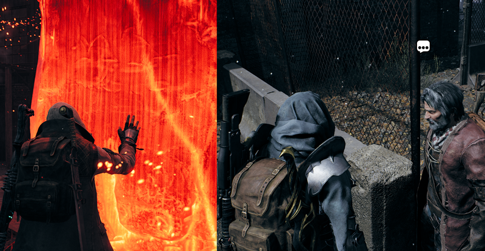
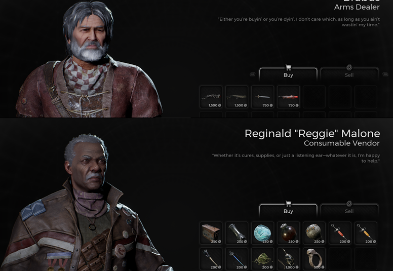

⚠️ Warning ⚠️

If you are linked directly to this instance but don't understand how this works then read the [readme](https://github.com/razeedazee/remnant2-instances/blob/main/README.md)

Info:

- Difficulty: Apocalypse
- Power level: N?A

Traits:

- N/A

Random Items Spawns:

- N/A

Fixed Items spawns:

- N/A

Fixed Items spawns - conditional rewards:

- Repulsor (Nightmare)
- Hero's Sword (Nightmare)
- Starkiller
- World's Edge

Injectables:

- N/A

Bosses:

- N/A

Notes:

> - Load into the save. You will be in Ward 13
>
> - Touch the World Stone after loading into Ward 13.
>
> - Back out of World Stone and go talk to merchants.

