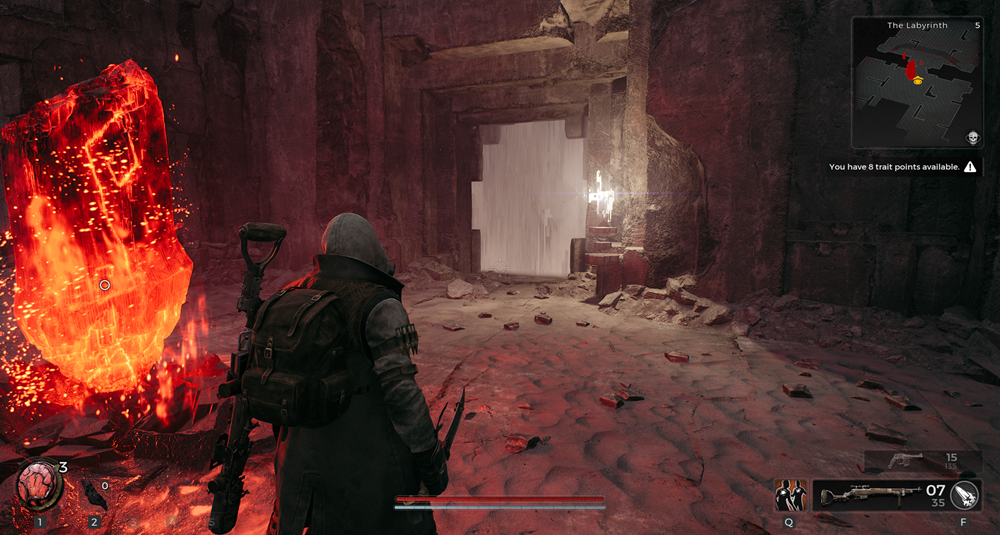
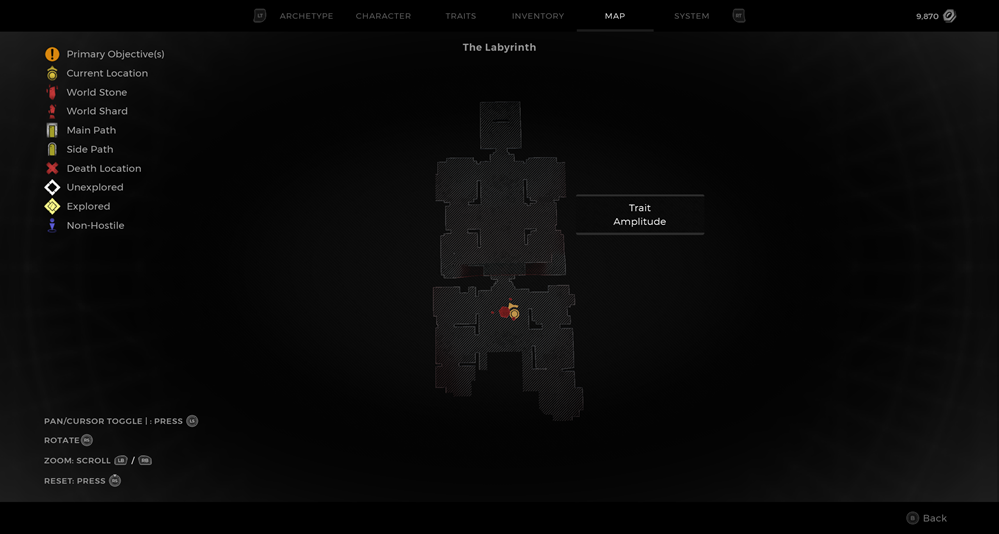
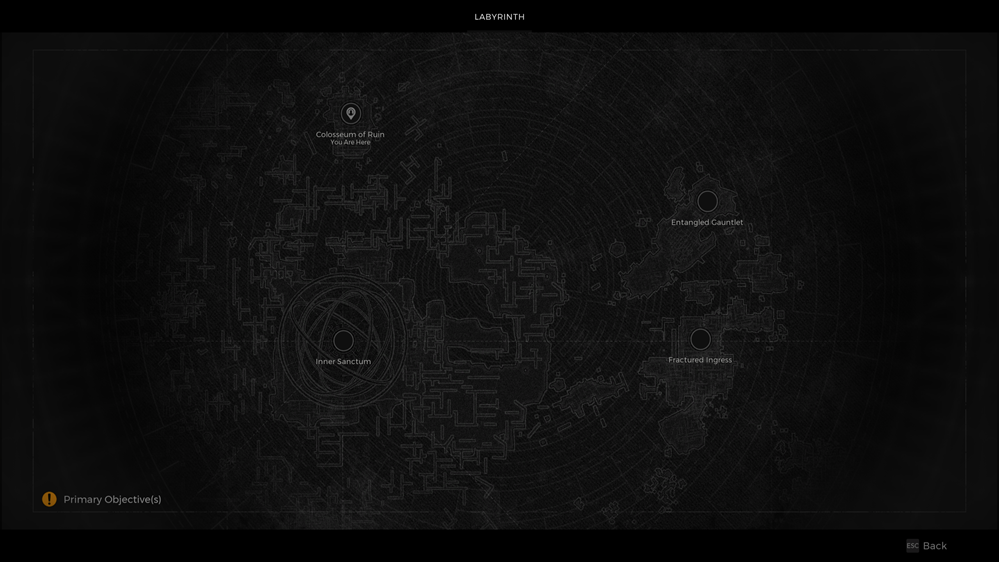

⚠️ Warning ⚠️

If you are linked directly to this instance but don't understand how this works then read the [readme](https://github.com/razeedazee/remnant2-instances/blob/main/README.md)

### Info

|     Location      | Sublocation | Difficulty | Power level | Checkpoint |
| :---------------: | :---------: | :--------: | :---------: | :--------: |
| Colosseum of Ruin |     N/A     |  Survivor  |      5      |     no     |

    

        
    

    

        
    

    

        
    

### Traits

|   Name    |                     Condition                     |
| :-------: | :-----------------------------------------------: |
| Amplitude | Completed Horde Event to aquire Master Portal Key |

### Random item Spawns

| Item | type | Location |
| :--: | :--: | :------: |
| N/A  | N/A  |   N/A    |

### Fixed item spawns

|        Item        |       type        |
| :----------------: | :---------------: |
|  Labyrinth Staff   |   Melee Weapon    |
|     Cipher Rod     | Crafting Material |
| Shard Banded Ring  |       Ring        |
| Dense Silicon Ring |       Ring        |
|   Encrypted Ring   |       Ring        |
|    Runed Heart     |       Relic       |

### Fixed item spawns - conditional rewards

|           Item           |       type        |                            Condition                             |
| :----------------------: | :---------------: | :--------------------------------------------------------------: |
|          Enigma          |   Melee Weapon    |            Via portal at Fractured Ingress Checkpoint            |
|         Cube Gun         | Crafting Material |                 Craft Conflux Prism into weapon                  |
|    Reprocessed Heart     |       Ring        | Portal Intertia Event Via portal at Fractured Ingress Checkpoint |
|     Vengeful Strike      |      Mutator      |     Kill Aberration - Bastion in location of Labyrinth Staff     |
|      Bisected Ring       |       Ring        |               Backrooms Event via corrupted portal               |
| Gunfire Security Lanyard |       Ring        |               Backrooms Event via corrupted portal               |
|       Strange Box        |      Engram       |               Backrooms Event via corrupted portal               |
|  Leto's Armour Mark II   |       Armor       |              Use biome portal key on hidden portal               |
|    Chicago Typewriter    |     Long Gun      |              Use biome portal key on hidden portal               |

### Injectable

| Name |    Unique Rewards     |
| :--: | :-------------------: |
| N/A  | <ul><li>N/A</li></ul> |

### Bosses

|       Name        | Condition |    Reward     |       Type        |
| :---------------: | :-------: | :-----------: | :---------------: |
| Labyrinth Sential |   Kill    | Conflux Prism | Crafting Material |

Checkpoint:

- Use check for fastest route to these items or events:
  - Aberration - Bastion - Go left of portal

### Quest items relevant to instance

|   In Inventory   |   Interactions    |
| :--------------: | :---------------: |
| Biome Portal Key | Use Biome Portals |

Notes:

>
