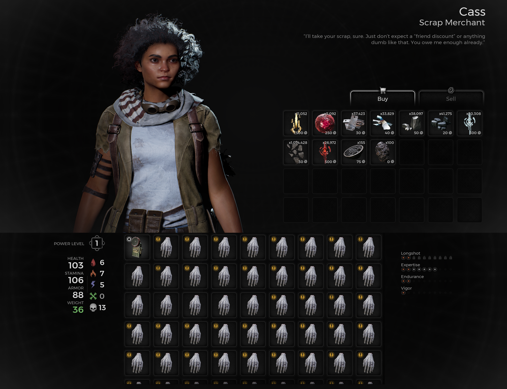
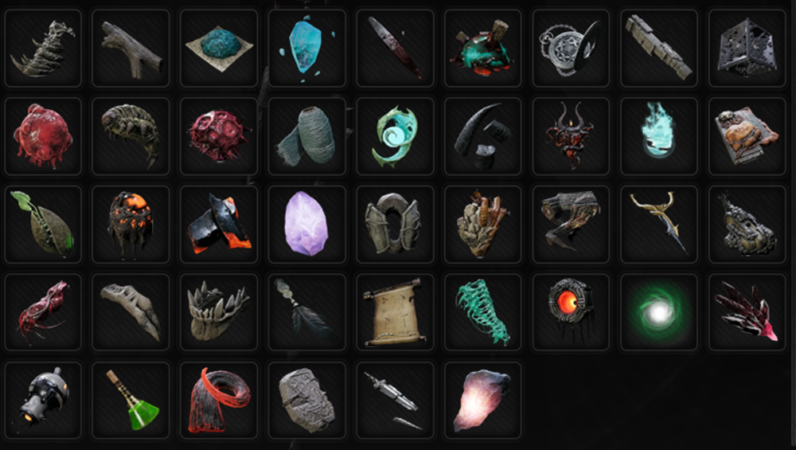

⚠️ Warning ⚠️

If you are linked directly to this instance but don't understand how this works then read the [readme](https://github.com/razeedazee/remnant2-instances/blob/main/README.md)

### Info

| Location | Sublocation | Difficulty | Power level | Checkpoint |
| :------: | :---------: | :--------: | :---------: | :--------: |
| Ward 13  |     N/A     |  Survivor  |     N/A     |     No     |

|                                                    Info                                                     |                                                       Minimap                                                        |                                                         Travel Map                                                         |
| :---------------------------------------------------------------------------------------------------------: | :------------------------------------------------------------------------------------------------------------------: | :------------------------------------------------------------------------------------------------------------------------: |
|  |  |  |

### Traits

| Name | Condition |
| :--: | :-------: |
| N/A  |    N/A    |

### Random item Spawns

| Item | type | Location |
| :--: | :--: | :------: |
| N/A  | N/A  |   N/A    |

### Fixed item spawns

| Item | type | Location |
| :--: | :--: | :------: |
| N/A  | N/A  |   N/A    |

##### Fixed item spawns - conditional rewards

| Item | type | Condition | Location |
| :--: | :--: | :-------: | :------: |
| N/A  | N/A  |    N/A    |          |

### Injectable

| Name |     Unique Rewards     |
| :--: | :--------------------: |
| N/A  | <ul><li> N/A</li></ul> |

### Bosses

| Name | Condition | Reward | Type |
| :--: | :-------: | :----: | :--: |
| N/A  |    N/A    |  N/A   | N/A  |

## Checkpoint

| Locality | notes |
| :------: | :---: |
|   N/A    |  N/A  |

### Quest items relevant to instance

| In Inventory | Interactions |
| :----------: | :----------: |
|     N/A      |     N/A      |

### Notes

> - Hands are already in the inventory already; you don't need pick them up.
> - Click on a hand and examine the finger to drop the ring for 250 scrap.
> - Cass has materials if you need to buy stuff.

### Inventory Table

|     Cass RNG Item     | Item Type |   Usage   |
| :-------------------: | :-------: | :-------: |
|    Mechanic's Cog     |   Ring    | equipment |
| Burden of the Gambler |   Ring    | equipment |
|    Amber Moonstone    |   Ring    | equipment |
|     Blessed Ring      |   Ring    | equipment |
|    Ring of Anguish    |   Ring    | equipment |

|      Material      |  Material Type   |            Usage            |
| :----------------: | :--------------: | :-------------------------: |
|        Iron        |     Upgrade      |           Weapons           |
|    Forged Iron     |     Upgrade      |           Weapons           |
|   Hardened Iron    |     Upgrade      |           Weapons           |
|  Galvanised Iron   |     Upgrade      |           Weapons           |
|      Lumenite      | Crafting/Upgrade |        Weapons/Mods         |
| Corrupted Lumenite | Crafting/Upgrade |          Mutators           |
|     Simulacrum     |     Upgrade      |           Weapons           |
|    Koara Pellet    |    Consumable    |            Stats            |
|  Processed Koara   |    Consumable    |            Stats            |
|     Relic Dust     |     Upgrade      |       Relic Fragments       |
| Bloodmoon Essence  |     Crafting     |       Bloodmoon Altar       |
|   Nimue's Dream    |     Teleport     |    Collect Anamy’s Echo     |
|  Huntress's Dream  |     Teleport     | Collect Sacred Hunt Feather |

|             Material             |       Craftable Item       |     Type     |
| :------------------------------: | :------------------------: | :----------: |
|          Acidic Jawbone          |         Gas Giant          | Melee Weapon |
|        Agnosia Driftwood         |          Fargazer          |  Weapon Mod  |
|         Alkahest Powder          |         Witchfire          |  Weapon Mod  |
|           Anamy’s Echo           |     Crescent Moon Bow      |   Long Gun   |
|      Bloody Steel Splinter       |         Blood Draw         |  Weapon Mod  |
|             Bone Sap             |      Voltaic Rondure       |  Weapon Mod  |
|         Broken Timepiece         |         Time Lapse         |  Weapon Mod  |
|            Cipher Rod            |        Enigma Rifle        |   Hand Gun   |
|          Conflux Prism           |          Cube Gun          |   Hand Gun   |
|         Cordyceps Gland          |           Tremor           |  Weapon Mod  |
|          Cracked Shell           |        Space Crabs         |  Weapon Mod  |
|         Crimson Membrane         |         Merciless          |   Long Gun   |
|        Cursed Dreams Silk        |         Nightfall          |   Long Gun   |
|          Decrepit Rune           |        Rune Pistol         |   Hand Gun   |
|          Doe's Antlers           |       Red Doe Staff        | Melee Weapon |
|            Dread Core            |           Skewer           |  Weapon Mod  |
|          Eidolon Shard           |       Spectral Blade       | Melee Weapon |
|        Escalation Circuit        |          Overflow          |  Weapon Mod  |
|            Faith Seed            |        Astral Burst        |  Weapon Mod  |
|         Forgotten Memory         |        Alpha-Omega         |   Long Gun   |
|         Forlorn Fragment         |         Firestorm          |  Weapon Mod  |
|            Heart Seed            |         Soulbinder         |  Weapon Mod  |
|           Hollow Heart           |        Stonebreaker        | Melee Weapon |
|         Imposter’s Heart         |           Deceit           |   Long Gun   |
|          Ionic Crystal           |        Energy Wall         |  Weapon Mod  |
|           Melded Hilt            |        Godsplitter         | Melee Weapon |
|          Mutated Growth          |            Bore            |  Weapon Mod  |
|         Necrocyte Strand         |           Defrag           |  Weapon Mod  |
|       Nightweaver's Finger       |         Nightshade         | Melee Weapon |
|          Ravager’s Maw           |      Feral Judgement       | Melee Weapon |
|       Sacred Hunt Feather        |          Familiar          |  Weapon Mod  |
|        Scroll of Binding         |         Song Eafir         |  Weapon Mod  |
|          Seeker Residue          |          Helix .           |  Weapon Mod  |
|        Sentry’s Old Iris         |      Prismatic Driver      |  Weapon Mod  |
| Shining Essence Echo (multi use) |   Siphon Heart Custodian   |    Relic     |
| Shining Essence Echo (multi use) | Void Idol Drzyr Replicator |    Amulet    |
|           Soul Silver            |        Rotted Arrow        |  Weapon Mod  |
|           Stasis Core            |        Stasis Beam         |  Weapon Mod  |
|          Tainted Ichor           |      Corrosive Rounds      |  Weapon Mod  |
|        Twilight Dactylus         |          Rootlash          |  Weapon Mod  |
|         Twisted Lazurite         |      Twisted Arbalest      |   Long Gun   |
|       Venerated Spearhead        |       Huntress Spear       | Melee Weapon |
|          Void Cynlinder          |          Aphelion          |   Long Gun   |
