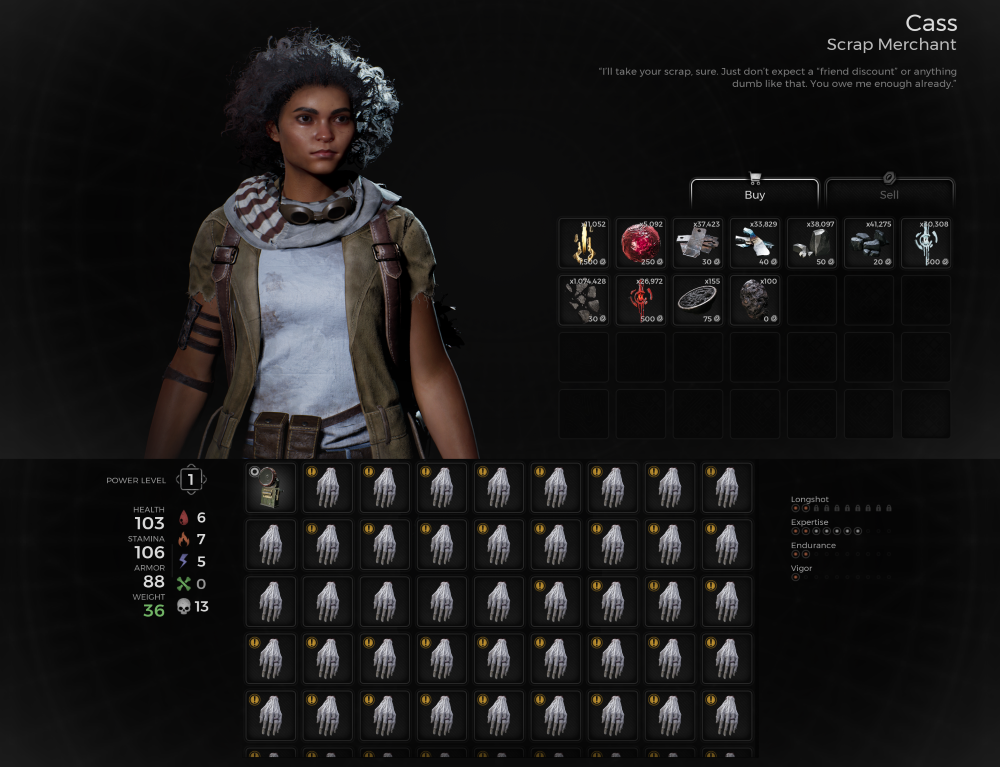

⚠️ Warning ⚠️

If you are linked directly to this instance but don't understand how this works then read the [readme](https://github.com/razeedazee/remnant2-instances/blob/main/README.md)

Info:

- Difficulty: Survivor
- Powerlevel: N/A

Traits:

- N/A

Random Items Spawns:

- N/A

Fixed Items spawns:

- N/A

Fixed Items spawns - conditional rewards:

- N/A

Injectables:

- N/A

Bosses:

- N/A

Notes:

> - Hands are already in the inventory already; you don't need pick them up.
> - Click on a hand and examine the finger to drop the ring for 250 scrap.
> - Cass has materials if you need to buy stuff.

