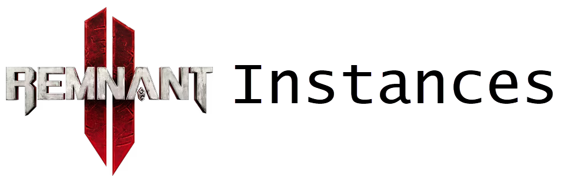
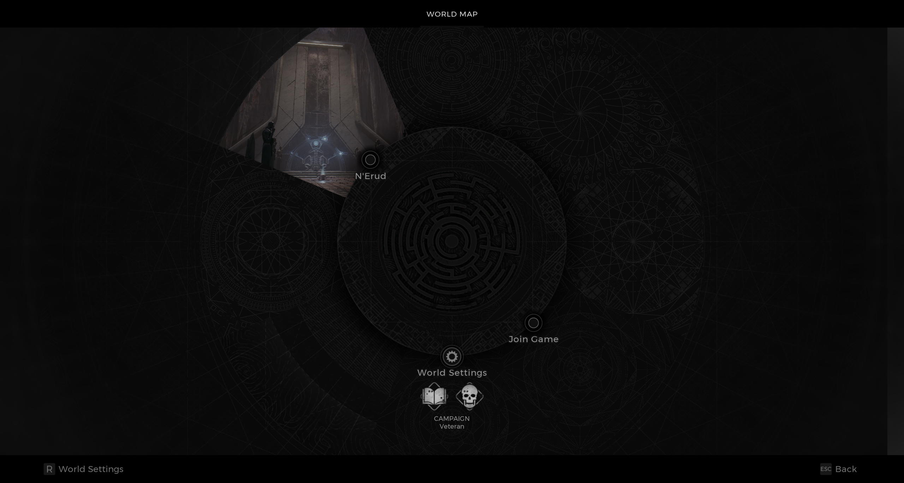

⚠️ Warning ⚠️

If you are linked directly to this instance but don't understand how this works then read the [readme](https://github.com/razeedazee/remnant2-instances/blob/main/README.md)

### Info

| Location  | Sublocation | Difficulty | Power level | Checkpoint |
| :-------: | :---------: | :--------: | :---------: | :--------: |
| Area name |     N/A     |  Survivor  |     1/5     |   Yes/No   |

### Traits

| Name | Condition |
| :--: | :-------: |
| N/A  |    N/A    |

### Random item Spawns

| Item | type | Location |
| :--: | :--: | :------: |
| N/A  | N/A  |   N/A    |

### Fixed item spawns

| Item | type | Location |
| :--: | :--: | :------: |
| N/A  | N/A  |   N/A    |

### Fixed item spawns - conditional rewards

| Item | type | Location | Condition |
| :--: | :--: | :------: | :-------: |
| N/A  | N/A  |   N/A    |    N/A    |

### Injectable

| Name |    Unique Rewards     |
| :--: | :-------------------: |
| N/A  | <ul><li>N/A</li></ul> |

### Bosses

| Name | Condition | Reward | Type |
| :--: | :-------: | :----: | :--: |
| N/A  |    N/A    |  N/A   | N/A  |

### Checkpoint

| Locality | notes |
| :------: | :---: |
|   N/A    |  N/A  |

### Quest items relevant to instance

| In Inventory | Interactions |
| :----------: | :----------: |
|     N/A      |     N/A      |

### Notes

>
